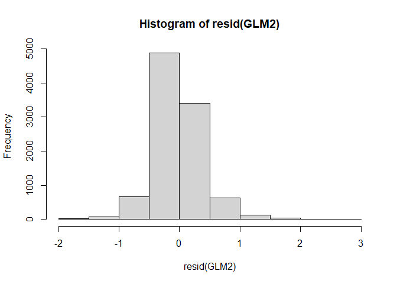
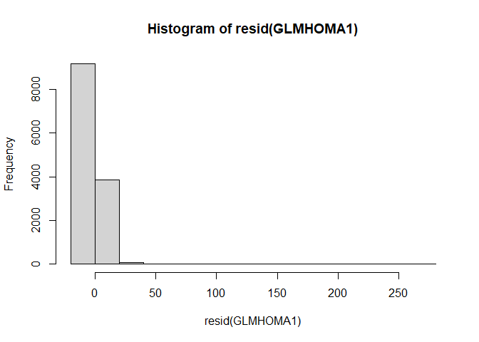

NHANES
================

## NHANES (complex survey) data analysis

This study aimed to evaluate the association between habitual caffeine
consumption and markers of insulin sensitivity (HOMA-IR, HbA1C, and
plasma glucose during a two-hour oral glucose tolerance test OGTT2H) in
the USA population. The data was obtained from NHANES, a biannual survey
designed to assess the health and nutritional status of adults and
children in the United States. For more information on NHANES, [click
here](https://www.cdc.gov/nchs/nhanes/index.htm).

## Step-by-step index

1.  [Obtaining data with the NHANES
    API.](https://github.com/gabsbarreto/portfolio1/blob/main/NHANES%20project/NHANES-Git.md#obtaining-data-from-nhanes-api)
2.  [Obtaining dietary data separate by assessment
    day](https://github.com/gabsbarreto/portfolio1/blob/main/NHANES%20project/NHANES-Git.md#dietary-data)
3.  [Calculating caffeine consumption separate by food
    source](https://github.com/gabsbarreto/portfolio1/blob/main/NHANES%20project/NHANES-Git.md#caffeine-by-food-source)
4.  [Calculating physical activity
    levels](https://github.com/gabsbarreto/portfolio1/blob/main/NHANES%20project/NHANES-Git.md#physical-activity)
5.  [Using chatGPT to categorise participans’ prescribed
    medication](https://github.com/gabsbarreto/portfolio1/blob/main/NHANES%20project/NHANES-Git.md#using-gpt-for-medication-data)
6.  [Merging all
    DFs](https://github.com/gabsbarreto/portfolio1/blob/main/NHANES%20project/NHANES-Git.md#merging-all-dataframes)
7.  [Final adjusments on
    data](https://github.com/gabsbarreto/portfolio1/blob/main/NHANES%20project/NHANES-Git.md#final-data-wrangling-procedures)
8.  [Creating the survey
    design](https://github.com/gabsbarreto/portfolio1/blob/main/NHANES%20project/NHANES-Git.md#survey-design)
9.  [Exploratory
    analysis](https://github.com/gabsbarreto/portfolio1/blob/main/NHANES%20project/NHANES-Git.md#exploratory-analysis)
10. [Fixing
    skewness](https://github.com/gabsbarreto/portfolio1/blob/main/NHANES%20project/NHANES-Git.md#fixing-skewness)
11. [Fitting the Gamma
    Model](https://github.com/gabsbarreto/portfolio1/blob/main/NHANES%20project/NHANES-Git.md#fitting-the-gamma-model)
12. [Stepwise
    Backwards](https://github.com/gabsbarreto/portfolio1/blob/main/NHANES%20project/NHANES-Git.md#stepwise-procedure)
13. [Estimate marginal means and
    plot](https://github.com/gabsbarreto/portfolio1/blob/main/NHANES%20project/NHANES-Git.md#estimated-means-and-plot)

### Packages used

``` r
library(nhanesA)
library(tidyverse)
library(survey)
library(emmeans)
library(openai)
library(car)
```

### Obtaining data from NHANES API

I used the NHANES API to obtain the datasets that interest me, one by
one, and merged them into a single df. Below there is an example using
the NHANES demographic data.

``` r
DEMOG0506 <- nhanes('DEMO_D') ##DEMOGRAPHICS 05-06
DEMOG0506.2 <- DEMOG0506 %>% ##SELECTING VARIABLES OF INTEREST
  select(SEQN, RIAGENDR, RIDAGEYR, RIDEXPRG,  RIDRETH1, DMDEDUC3, DMDEDUC2, INDFMINC, SDMVPSU, SDMVSTRA, WTINT2YR, WTMEC2YR) 
rm(DEMOG0506)

DEMOG0708 <- nhanes('DEMO_E') ##DEMOGRAPHICS 07-08
DEMOG0708.2 <- DEMOG0708 %>% ##SELECTING VARIABLES OF INTEREST
  select(SEQN, RIAGENDR, RIDAGEYR, RIDEXPRG,  RIDRETH1, DMDEDUC3, DMDEDUC2, INDFMIN2, #VARIABLE NAME DIFFERENT FROM LAST CYCLE 
         SDMVPSU, SDMVSTRA, WTINT2YR, WTMEC2YR) %>%
  rename(INDFMINC = INDFMIN2) ##RENAME VARIABLE TO MATCH LAST CYCLE
rm(DEMOG0708)

DEMOG0910 <- nhanes('DEMO_F') ##DEMOGRAPHICS 09-10
DEMOG0910.2 <- DEMOG0910 %>% ##SELECTING VARIABLES OF INTEREST
  select(SEQN, RIAGENDR, RIDAGEYR, RIDEXPRG,  RIDRETH1, DMDEDUC3, DMDEDUC2, INDFMIN2, #VARIABLE NAME DIFFERENT FROM LAST CYCLE 
         SDMVPSU, SDMVSTRA, WTINT2YR, WTMEC2YR) %>%
  rename(INDFMINC = INDFMIN2) ##RENAME VARIABLE TO MATCH LAST CYCLE
rm(DEMOG0910)

DEMOG1112 <- nhanes('DEMO_G') ##DEMOGRAPHICS 11-12
DEMOG1112.2 <- DEMOG1112 %>% ##SELECTING VARIABLES OF INTEREST
  select(SEQN, RIAGENDR, RIDAGEYR, RIDEXPRG,  RIDRETH1, DMDEDUC3, DMDEDUC2, INDFMIN2, #VARIABLE NAME DIFFERENT FROM LAST CYCLE 
         SDMVPSU, SDMVSTRA, WTINT2YR, WTMEC2YR) %>%
  rename(INDFMINC = INDFMIN2) ##RENAME VARIABLE TO MATCH LAST CYCLE
rm(DEMOG1112)


DEMOG1314 <- nhanes('DEMO_H') ##DEMOGRAPHICS 13-14
DEMOG1314.2 <- DEMOG1314 %>% ##SELECTING VARIABLES OF INTEREST
  select(SEQN, RIAGENDR, RIDAGEYR, RIDEXPRG,  RIDRETH1, DMDEDUC3, DMDEDUC2, INDFMIN2, #VARIABLE NAME DIFFERENT FROM LAST CYCLE 
         SDMVPSU, SDMVSTRA, WTINT2YR, WTMEC2YR) %>%
  rename(INDFMINC = INDFMIN2) ##RENAME VARIABLE TO MATCH LAST CYCLE
rm(DEMOG1314)

DEMOG1516 <- nhanes('DEMO_I') ##DEMOGRAPHICS 15-16
DEMOG1516.2 <- DEMOG1516 %>% ##SELECTING VARIABLES OF INTEREST
  select(SEQN, RIAGENDR, RIDAGEYR, RIDEXPRG,  RIDRETH1, DMDEDUC3, DMDEDUC2, INDFMIN2, #VARIABLE NAME DIFFERENT FROM LAST CYCLE 
         SDMVPSU, SDMVSTRA, WTINT2YR, WTMEC2YR) %>%
  rename(INDFMINC = INDFMIN2) ##RENAME VARIABLE TO MATCH LAST CYCLE
rm(DEMOG1516)

DEMOG0416 <- bind_rows(DEMOG0506.2,
                       DEMOG0708.2,
                       DEMOG0910.2,
                       DEMOG1112.2,
                       DEMOG1314.2,
                       DEMOG1516.2)
rm(DEMOG0506.2,
   DEMOG0708.2,
   DEMOG0910.2,
   DEMOG1112.2,
   DEMOG1314.2,
   DEMOG1516.2)
```

#### General data

Data on body composition (BMX_D - I), the results of the 2-h oral
glucose tolerance test (OGTT_D - I), fasting glucose and insulin
(GLU_D - I or INS_H - I \[they were separated after the 13-14 cycle\]),
glycohemoglobine (GHB_D - I), and blood pressure (BPX_D - I) were also
obtained.

Glucose and Insulin values were used to calculate the HOMA-IR.

#### Dietary data

For dietary data, NHANES has two days of data collection, one during the
examination phase, and another one via phone call. I pulled the total
results for macronutrients and caffeine separate for both days
(DR1TOT_D - I and DR2TOT_D - I), binding them together.

Example:

``` r
DIET0506.1 <- nhanes('DR1TOT_D')
DIET0506.1.2 <- DIET0506.1 %>%
  select(SEQN, WTDRD1, WTDR2D,  DR1DAY, DR1TKCAL, DR1TPROT,  DR1TCARB,DR1TTFAT,DR1TMFAT,DR1TPFAT, DR1TSFAT, DR1TCAFF,DR1TALCO, DR1TSUGR, DR1TFIBE )

DIET0506.2 <- nhanes('DR2TOT_D')
DIET0506.2.2 <- DIET0506.2 %>%
  select(SEQN, DR2DAY, DR2TKCAL, DR2TPROT,  DR2TCARB,DR2TTFAT,DR2TMFAT,DR2TPFAT, DR2TSFAT, DR2TCAFF,DR2TALCO, DR2TSUGR, DR2TFIBE )

DIET0506FULL <- merge(DIET0506.1.2,DIET0506.2.2, by = 'SEQN', all = T)

[...]

DIETALLFULL <- bind_rows(DIET0506FULL,
                         DIET0708FULL,
                         DIET0910FULL,
                         DIET1112FULL,
                         DIET1314FULL,
                         DIET1516FULL)
```

Visualising:

``` r
head(DIETALLFULL)
```

    ##    SEQN    WTDRD1    WTDR2D   DR1DAY DR1TKCAL DR1TPROT DR1TCARB DR1TTFAT
    ## 1 31127  4718.873  5906.472 Saturday     1421    50.42   171.45    61.28
    ## 2 31128  3933.789  4250.890   Friday     1402    32.51   180.88    65.05
    ## 3 31129 26719.806 26719.806   Monday     4110   139.89   684.22    94.73
    ## 4 31130        NA        NA     <NA>       NA       NA       NA       NA
    ## 5 31131 13595.896 14822.479   Friday     1458    27.43   233.73    50.86
    ## 6 31132 40484.136 45660.639  Tuesday     2168    75.81   269.93    60.16
    ##   DR1TMFAT DR1TPFAT DR1TSFAT DR1TCAFF DR1TALCO DR1TSUGR DR1TFIBE    DR2DAY
    ## 1   20.509    8.098   25.994        0      0.0   139.02      4.6    Sunday
    ## 2   17.128   17.755   23.381       33      0.0    88.69     10.0    Monday
    ## 3   37.018   12.180   38.599        7      0.0   498.82     14.5    Sunday
    ## 4       NA       NA       NA       NA       NA       NA       NA      <NA>
    ## 5   20.745    7.641   18.274       13      0.0   146.01      6.4 Wednesday
    ## 6   17.494   19.114   17.608      260     40.8   111.54     20.3    Sunday
    ##   DR2TKCAL DR2TPROT DR2TCARB DR2TTFAT DR2TMFAT DR2TPFAT DR2TSFAT DR2TCAFF
    ## 1     1302    46.11   165.96    51.85   17.254    5.816   23.509        0
    ## 2     1797    94.60   158.68    87.39   31.070   17.140   31.164        0
    ## 3     3092    79.47   420.63   125.23   49.236   31.040   38.181        0
    ## 4       NA       NA       NA       NA       NA       NA       NA       NA
    ## 5     2044    58.33   239.08   100.15   32.824   17.284   42.619       19
    ## 6     1446    54.53   183.59    42.75   13.705    5.343   20.341      302
    ##   DR2TALCO DR2TSUGR DR2TFIBE
    ## 1      0.0   103.67      5.6
    ## 2      0.0    87.13      5.5
    ## 3      0.0   195.93     19.4
    ## 4       NA       NA       NA
    ## 5      0.0   118.39      9.9
    ## 6     21.2   109.35     18.6

#### Caffeine by food source

Besides the total calculated nutrients, NHANES also makes available the
full dietary records of their participants, separating them by food
product (DR1IFF_D and DR2IFF_D - I). The codes and names for the food
products are also listed separately (DRXFCD_D - I).

I aimed to separate caffeine from coffee and tea from other food
sources. This is how I managed:

``` r
#### DAY 1

oodcode0506 <- nhanes('DRXFCD_D') ## obtaining DF with food codes
FOOD0506.1 <- nhanes('DR1IFF_D') ## obtaining DF with food products on day 1

FOOD0506.1.2 <- FOOD0506.1 %>%
  rename(DRXFDCD = DR1IFDCD ) %>% ### changing the name of the food code variable
  merge(.,foodcode0506, .by = 'DRXFDCD', all = T) %>% ##merging dfs
  filter(DR1ICAFF > 0 ) %>% ### kept only caffeine food sources
  mutate(coffeeandtea = ifelse(grepl('COFFEE', DRXFCSD) | grepl('TEA', DRXFCSD) & !grepl('STEAK', DRXFCSD), 1,0))   ##signaling the variables that have coffee  OR tea in their product name; it would include products with 'STEAK', so I removed those 


SUMMCOFFEE0506.1 <- FOOD0506.1.2 %>%   
  group_by(SEQN, coffeeandtea) %>%
  summarise_at(vars(DR1ICAFF), funs(sum(.,na.rm= T))) %>%     ##obtaining the total amount of caffeine from each source (coffee and tea/others)
  pivot_wider(values_from = DR1ICAFF, names_from = coffeeandtea, names_sep = '_')

#### DAY 2
FOOD0506.2 <- nhanes('DR2IFF_D') ## obtaining DF with food products on day  2

FOOD0506.2.2 <- FOOD0506.2 %>%
  rename(DRXFDCD = DR2IFDCD ) %>% ### changing the name of the food code variable
  merge(.,foodcode0506, .by = 'DRXFDCD', all = T) %>% ##merging dfs
  filter(DR2ICAFF > 0 ) %>% ### kept only caffeine food sources
  mutate(coffeeandtea = ifelse(grepl('COFFEE', DRXFCSD) | grepl('TEA', DRXFCSD) & !grepl('STEAK', DRXFCSD),  1,0))   ##signaling the variables that have coffee  OR tea in their product name; it would include products with 'STEAK', so I removed those 


SUMMCOFFEE0506.2 <- FOOD0506.2.2 %>%   
  group_by(SEQN, coffeeandtea) %>%
  summarise_at(vars(DR2ICAFF), funs(sum(.,na.rm= T))) %>%     ##obtaining the total amount of caffeine from each source (coffee and tea/others)
  pivot_wider(values_from = DR1ICAFF, names_from = coffeeandtea, names_sep = '_')


#### JOINING BOTH DAYS
summ0506join <- full_join(SUMMCOFFEE0506.1,SUMMCOFFEE0506.2, by = 'SEQN') %>%
  rename(CAFFother1 = '0.x', CAFFother2 = "0.y", CAFFcoffeetea1 = '1.x', CAFFcoffeetea2 = "1.y") ###when joined, it is ideal to differentiate which one is from day 1 and day 2
```

Visualising

``` r
head(summ0506join)
```

    ## # A tibble: 6 × 5
    ## # Groups:   SEQN [6]
    ##    SEQN CAFFother1 CAFFcoffeetea1 CAFFother2 CAFFcoffeetea2
    ##   <dbl>      <dbl>          <dbl>      <dbl>          <dbl>
    ## 1 31128         33             NA         NA             NA
    ## 2 31129          7             NA         NA             NA
    ## 3 31131          5              8          8             11
    ## 4 31132         NA            260         NA            302
    ## 5 31133         71             NA         32             NA
    ## 6 31134         NA            142        103              2

#### Physical activity

Regarding participants’ physical activity, the extracted data was
available separated by type of physical activity (e.g., commuting,
moderate or vigorous work-related or non work-related). For commuting
and moderate physical activities, a MET score of 4 was given, and of 8
for vigorous. This is how I handled it:

``` r
PAQ0708 <- nhanes('PAQ_E')
PAQ07082 <- PAQ0708 %>%
  select(SEQN, PAQ605, PAQ610, PAD615, PAQ620,PAQ625,PAD630,PAQ635,PAQ640,PAD645,PAQ650,
         PAQ655,PAD660,PAQ665,PAQ670,PAD675) %>% ##selecting variables of interest
  mutate(vigorouswork = case_when(PAQ610 <=7 & PAD615 <= 960 ~ PAQ610 * PAD615, 
                                     PAQ610 >7 | PAD615 > 960 ~0,
                                     is.na(PAQ610) | is.na(PAD615) ~ 0 )) %>%     ### multiplying days of activity (PAQ) by the average time of activity(PAD) for each of the activities
  mutate(moderatework = case_when(PAQ625 <=7 & PAD630 <= 1440 ~ PAQ625 * PAD630, 
                                  PAQ625 >7 | PAD630 > 1440 ~0,
                                  is.na(PAQ625) | is.na(PAD630) ~ 0 )) %>%
  mutate(bicyclewalk = case_when(PAQ640 <=7 & PAD645 <= 600 ~ PAQ640 * PAD645, 
                                  PAQ640 >7 | PAD645 > 600 ~0,
                                  is.na(PAQ640) | is.na(PAD645) ~ 0 )) %>%
  mutate(vigrec = case_when(PAQ655 <=7 & PAD660 <= 990 ~ PAQ655 * PAD660, 
                                 PAQ655 >7 | PAD660 > 990 ~0,
                                 is.na(PAQ655) | is.na(PAD660) ~ 0 )) %>%
  mutate(modrec = case_when(PAQ670 <=7 & PAD675 <= 720 ~ PAQ670 * PAD675, 
                            PAQ670 >7 | PAD675 > 720 ~0,
                            is.na(PAQ670) | is.na(PAD675) ~ 0 )) %>%
  mutate(totalMET = ( (vigorouswork + vigrec) * 8) + ((moderatework + bicyclewalk + modrec) * 4)    )  #### multiplying the total time (average-time * days) by the MET provided by the NHANES organisers
```

#### Using GPT for medication data

Each participant has provided a list of prescribed medication consumed
in the 30 days preceding the interview. These datasets are available as
‘RXQ_RX_E - I’.

My idea was to categorise those participants between those who were (or
were not) taking oral hypoglycemic drugs and blood pressure medication,
and include those in the statistical models.

I used the openAI API for that, obtaining “Yes” or “No” answers to the
classes of drugs I was interested in:

``` r
### First I established the system and specific prompts
systemprompt <- 'You have all knowledge about pharmacology, medications, their purpose and prescription'
diabetesmed <- "Is this medication classified as an oral antihyperglycemic drug? The only acceptable answers are: 'Yes' or 'No'"
pressuremed <- "Is this medication prescribed for the control of high blood pressure? The only acceptable answers are: 'Yes' or 'No'"

####Then I created a function to send the requests to the API
get_gpt_response <- function(prompt) {
  if (is.null(prompt) || is.na(prompt)) {
    return(NA)
  }
  response <- create_chat_completion(  ### THIS FUNCTION GENERATES A GPT RESPONSE
    model = "gpt-4o",   ### 4o WAS THE MODEL I CHOSE THIS TIME
    messages = list(
      list("role" = "system", "content" = systemprompt),
      list("role" = "user", "content" = prompt)
    ),
    n = 1,   ### ONLY ONE RESPONSE REQUESTED
    max_tokens = 300,   ### LIMITING THE MAX TOKENS GENERATED
    stop = NULL,
    openai_api_key = "----", #### Making sure not to show everyone my OPENAI key.
    temperature = 0.1    #### TEMPERATURE REFERS TO THE OBJECTIVENESS, and when Temperature ~ 0, objectiveness increases.
  )
  # Extract the message content from the response
  content <- response[["choices"]][["message.content"]]
  return(content)
}


#### THEN I CREATED THE FUNCTION TO SEND THE API THE DATA I WANTED A RESPONSE TO.
process_dataframe <- function(df) { ### used my PRESCRIBED DRUG df

  
  df <- df %>%   ### creating the columns 
  mutate(GPT_glycemic = as.numeric(NA),
         GPT_bloodpressure = as.numeric(NA))

  for (i in seq_along(df$RXDDRUG)) {    #### sending the request
    message <-  paste("Medication: ", df$RXDDRUG[i],". ",diabetesmed, sep = '')
    response <- get_gpt_response(message)
    df$GPT_glycemic[i] <- response ### storing the response
  }
  
  for (i in seq_along(df$RXDDRUG)) {     #### sending the request
    message <-  paste("Medication: ", df$RXDDRUG[i],". ",pressuremed, sep = '')
    response <- get_gpt_response(message)
    df$GPT_bloodpressure[i] <- response   ### storing the response
  }
  
  return(df)
}


GPTDFprescriptions <- process_dataframe(DFprescriptions)
```

My DFprescriptions table was a list of unique(medication) used by the
NHANES participants with the response columns:

``` r
head(GPTDFprescriptions)
```

    ##               RXDDRUG GPT_glycemic GPT_bloodpressure
    ## 1            ATENOLOL           No              Yes.
    ## 2 HYDROCHLOROTHIAZIDE           No               Yes
    ## 3       LEVOTHYROXINE           No                No
    ## 4          LOVASTATIN           No                No
    ## 5   MUPIROCIN TOPICAL           No                No
    ## 6           GLIPIZIDE          Yes                No

The obtained responses (GPTDFprescriptions) were merged with the
dataframe containing the full prescriptions, which was then summarised,
keeping only a single row for each participant.

``` r
medsfull2 <- PMedication %>%
  merge(GPTDFprescriptions,., by = 'RXDDRUG', all = T) 

medsfull3 <- medsfull2 %>%
  mutate(GPT_glycemic = ifelse(is.na(GPT_glycemic), 'No',GPT_glycemic)) %>%
  mutate(GPT_bloodpressure = ifelse(is.na(GPT_bloodpressure), 'No',GPT_bloodpressure)) %>%
  filter(RXDUSE == "Yes") %>%
  mutate(GPT_insulin = ifelse(grepl("INSULIN", RXDDRUG), "Yes", "No") )   ### I ALSO ADDED A COLUMN FOR INSULIN USERS

medsfull4 <- medsfull3 %>% ### SUMMARISING AND MAKING SURE EACH PARTICIPANT (SEQN is the participant ID) appeared only once
  group_by(SEQN) %>%
  summarise(
    GPT_glycemic = ifelse(any(GPT_glycemic == "Yes"), "Yes", "No"),
    GPT_bloodpressure = ifelse(any(GPT_bloodpressure == "Yes"), "Yes", "No"),
    GPT_insulin = ifelse(any(GPT_insulin == "Yes"), "Yes", "No")
  )
```

Visualising:

``` r
head(medsfull4)
```

    ## # A tibble: 6 × 4
    ##    SEQN GPT_glycemic GPT_bloodpressure GPT_insulin
    ##   <dbl> <chr>        <chr>             <chr>      
    ## 1 41475 No           Yes               No         
    ## 2 41476 No           No                No         
    ## 3 41477 Yes          Yes               No         
    ## 4 41482 No           Yes               No         
    ## 5 41483 No           Yes               No         
    ## 6 41486 No           Yes               No

#### Merging all dataframes

All data sets were merged together, forming a single df:

``` r
FULLALL <- DEMOGRAPHICS %>%
  merge(.,BODYCOMP, by = 'SEQN', all = T) %>%
  merge(.,OGTT2H, by = 'SEQN', all = T) %>%
  merge(.,GLUCINSULIN, by = 'SEQN', all = T) %>%
  merge(.,TOTALDIET, by = 'SEQN', all = T) %>%
  merge(.,COFFEEANDTEA, by = 'SEQN', all = T) %>%
  merge(.,PHYSICALACT, by = 'SEQN', all = T) %>%
  merge(.,GLUCOHEMOGL, by = 'SEQN',all = T) %>%
  merge(.,MEDSFULL4, by = 'SEQN', all = T)
```

``` r
head(FULLALL)
```

    ##    SEQN                    BMDSTATS BMXWT BMIWT BMXRECUM BMIRECUM BMXHEAD
    ## 1 31127 Complete data for age group  10.2  <NA>     73.6     <NA>      NA
    ## 2 31128 Complete data for age group  40.1  <NA>       NA     <NA>      NA
    ## 3 31129 Complete data for age group  74.6  <NA>       NA     <NA>      NA
    ## 4 31130  No body measures exam data    NA  <NA>       NA     <NA>      NA
    ## 5 31131          Other partial exam  75.2  <NA>       NA     <NA>      NA
    ## 6 31132 Complete data for age group  69.5  <NA>       NA     <NA>      NA
    ##   BMIHEAD BMXHT BMIHT BMXBMI BMXLEG BMILEG BMXCALF BMICALF BMXARML BMIARML
    ## 1      NA    NA  <NA>     NA     NA     NA      NA      NA    16.0      NA
    ## 2      NA 151.6  <NA>  17.45   37.6     NA    29.3      NA    34.3      NA
    ## 3      NA 167.7  <NA>  26.53   42.7     NA    40.6      NA    36.5      NA
    ## 4      NA    NA  <NA>     NA     NA     NA      NA      NA      NA      NA
    ## 5      NA 156.0  <NA>  30.90   38.0     NA    36.6      NA    35.0      NA
    ## 6      NA 167.6  <NA>  24.74   40.4     NA    35.6      NA    37.5      NA
    ##   BMXARMC BMIARMC BMXWAIST BMIWAIST BMXTHICR BMITHICR BMXTRI           BMITRI
    ## 1    15.5      NA       NA       NA       NA       NA   12.8             <NA>
    ## 2    21.7      NA     62.8       NA     39.5       NA   10.4             <NA>
    ## 3    32.6      NA     97.8       NA     55.9       NA   18.8             <NA>
    ## 4      NA      NA       NA       NA       NA       NA     NA             <NA>
    ## 5    35.8      NA     96.0       NA     53.7       NA     NA Exceeds capacity
    ## 6    31.2      NA     96.5       NA     48.0       NA   10.4             <NA>
    ##   BMXSUB           BMISUB BMDBMIC BMXSAD1 BMXSAD2 BMXSAD3 BMXSAD4 BMDAVSAD
    ## 1   10.0             <NA>    <NA>      NA      NA      NA      NA       NA
    ## 2    8.4             <NA>    <NA>      NA      NA      NA      NA       NA
    ## 3   17.6             <NA>    <NA>      NA      NA      NA      NA       NA
    ## 4     NA             <NA>    <NA>      NA      NA      NA      NA       NA
    ## 5     NA Could not obtain    <NA>      NA      NA      NA      NA       NA
    ## 6   22.2             <NA>    <NA>      NA      NA      NA      NA       NA
    ##   BMDSADCM RIAGENDR RIDAGEYR                RIDEXPRG           RIDRETH1
    ## 1     <NA>     Male        0                    <NA> Non-Hispanic White
    ## 2     <NA>   Female       11 SP not pregnant at exam Non-Hispanic Black
    ## 3     <NA>     Male       15                    <NA> Non-Hispanic Black
    ## 4     <NA>   Female       85                    <NA> Non-Hispanic White
    ## 5     <NA>   Female       44 SP not pregnant at exam Non-Hispanic Black
    ## 6     <NA>     Male       70                    <NA> Non-Hispanic White
    ##     DMDEDUC3                  DMDEDUC2           INDFMINC SDMVPSU SDMVSTRA
    ## 1       <NA>                      <NA> $15,000 to $19,999       2       44
    ## 2  4th Grade                      <NA> $20,000 to $24,999       1       52
    ## 3 10th Grade                      <NA> $65,000 to $74,999       1       51
    ## 4       <NA> Some College or AA degree $15,000 to $19,999       2       46
    ## 5       <NA> Some College or AA degree   $75,000 and Over       1       48
    ## 6       <NA> College Graduate or above   $75,000 and Over       2       52
    ##    WTINT2YR  WTMEC2YR       TUA        AMA ARMCFATCIRC ARMFATINDEX WAISTHEIGHT
    ## 1  6434.950  6571.396  188.6919 48.5981226    130.0938   0.6894508          NA
    ## 2  9081.701  8987.042  369.8361  9.5809009    353.7552   0.9565188   0.4142480
    ## 3  5316.895  5586.719  834.6898 55.7228805    768.9669   0.9212607   0.5831843
    ## 4 29960.840 34030.995        NA         NA          NA          NA          NA
    ## 5 26457.708 26770.585 1006.5977         NA          NA          NA   0.6153846
    ## 6 32961.510 35315.539  764.5380  0.1725593    754.3654   0.9866945   0.5757757
    ##     BFPRED WTSOG2YR LBXGLT WTSAF2YR LBXGLU LBXIN    WTDRD1    WTDR2D   DR1DAY
    ## 1       NA       NA     NA       NA     NA    NA  4718.873  5906.472 Saturday
    ## 2 25.85972       NA     NA       NA     NA    NA  3933.789  4250.890   Friday
    ## 3 30.39665       NA     NA       NA     NA    NA 26719.806 26719.806   Monday
    ## 4       NA       NA     NA     0.00     NA    NA        NA        NA     <NA>
    ## 5       NA 71634.17    126 67556.81     90 10.03 13595.896 14822.479   Friday
    ## 6 27.97084 80226.50     NA 80193.96    157  8.99 40484.136 45660.639  Tuesday
    ##   DR1TKCAL DR1TPROT DR1TCARB DR1TTFAT DR1TMFAT DR1TPFAT DR1TSFAT DR1TCAFF
    ## 1     1421    50.42   171.45    61.28   20.509    8.098   25.994        0
    ## 2     1402    32.51   180.88    65.05   17.128   17.755   23.381       33
    ## 3     4110   139.89   684.22    94.73   37.018   12.180   38.599        7
    ## 4       NA       NA       NA       NA       NA       NA       NA       NA
    ## 5     1458    27.43   233.73    50.86   20.745    7.641   18.274       13
    ## 6     2168    75.81   269.93    60.16   17.494   19.114   17.608      260
    ##   DR1TALCO DR1TSUGR DR1TFIBE    DR2DAY DR2TKCAL DR2TPROT DR2TCARB DR2TTFAT
    ## 1      0.0   139.02      4.6    Sunday     1302    46.11   165.96    51.85
    ## 2      0.0    88.69     10.0    Monday     1797    94.60   158.68    87.39
    ## 3      0.0   498.82     14.5    Sunday     3092    79.47   420.63   125.23
    ## 4       NA       NA       NA      <NA>       NA       NA       NA       NA
    ## 5      0.0   146.01      6.4 Wednesday     2044    58.33   239.08   100.15
    ## 6     40.8   111.54     20.3    Sunday     1446    54.53   183.59    42.75
    ##   DR2TMFAT DR2TPFAT DR2TSFAT DR2TCAFF DR2TALCO DR2TSUGR DR2TFIBE CAFFother1
    ## 1   17.254    5.816   23.509        0      0.0   103.67      5.6         NA
    ## 2   31.070   17.140   31.164        0      0.0    87.13      5.5         33
    ## 3   49.236   31.040   38.181        0      0.0   195.93     19.4          7
    ## 4       NA       NA       NA       NA       NA       NA       NA         NA
    ## 5   32.824   17.284   42.619       19      0.0   118.39      9.9          5
    ## 6   13.705    5.343   20.341      302     21.2   109.35     18.6         NA
    ##   CAFFcoffeetea1 CAFFother2 CAFFcoffeetea2 PAQ605 PAQ610 PAD615 PAQ620 PAQ625
    ## 1             NA         NA             NA   <NA>     NA     NA   <NA>     NA
    ## 2             NA         NA             NA   <NA>     NA     NA   <NA>     NA
    ## 3             NA         NA             NA   <NA>     NA     NA   <NA>     NA
    ## 4             NA         NA             NA   <NA>     NA     NA   <NA>     NA
    ## 5              8          8             11   <NA>     NA     NA   <NA>     NA
    ## 6            260         NA            302   <NA>     NA     NA   <NA>     NA
    ##   PAD630 PAQ635 PAQ640 PAD645 PAQ650 PAQ655 PAD660 PAQ665 PAQ670 PAD675 LBXGH
    ## 1     NA   <NA>     NA     NA   <NA>     NA     NA   <NA>     NA     NA    NA
    ## 2     NA   <NA>     NA     NA   <NA>     NA     NA   <NA>     NA     NA    NA
    ## 3     NA   <NA>     NA     NA   <NA>     NA     NA   <NA>     NA     NA    NA
    ## 4     NA   <NA>     NA     NA   <NA>     NA     NA   <NA>     NA     NA    NA
    ## 5     NA   <NA>     NA     NA   <NA>     NA     NA   <NA>     NA     NA    NA
    ## 6     NA   <NA>     NA     NA   <NA>     NA     NA   <NA>     NA     NA    NA
    ##   GPT_glycemic GPT_bloodpressure GPT_insulin BPXPLS BPXSY1 BPXDI1 BPXSY2 BPXDI2
    ## 1         <NA>              <NA>        <NA>     NA     NA     NA     NA     NA
    ## 2         <NA>              <NA>        <NA>     84    100     62     NA     NA
    ## 3         <NA>              <NA>        <NA>     96    104     76    106     72
    ## 4         <NA>              <NA>        <NA>     70     NA     NA     NA     NA
    ## 5         <NA>              <NA>        <NA>     58    144     74    140     72
    ## 6         <NA>              <NA>        <NA>     62    138     60    130     58
    ##   BPXSY3 BPXDI3 BPXSY4 BPXDI4
    ## 1     NA     NA     NA     NA
    ## 2     NA     NA     NA     NA
    ## 3    108     70     NA     NA
    ## 4     NA     NA     NA     NA
    ## 5    134     74     NA     NA
    ## 6    124     54     NA     NA

As you can see, there are plenty of missing values and variables to
adjust.

### Final data wrangling procedures

Most of the categories I have created, when merged into the FULL
demographic dataset, will generate missing values. First, since the
method for the assessment of physical activity changed between the 05-06
cycle and the next, I decided to not use the 05-06 cycle. I used the
SEQN variable to exclude those participants:

``` r
FULLDATA2 <- FULLDATA %>%
  filter(SEQN >= 41475) 
```

Then, I corrected the information on medication:

1.  first, if the value was NA, it meant that the participant did NOT
    take medication. Therefore, I imputed “No” for all these cases.

2.  GPT sometimes replied with final stops. I removed those with gsub().

``` r
FULLDATA3 <- FULLDATA2 %>%
  mutate(GPT_glycemic = ifelse(is.na(GPT_glycemic), "No", GPT_glycemic),
         GPT_bloodpressure = ifelse(is.na(GPT_bloodpressure), "No", GPT_bloodpressure),
         GPT_insulin = ifelse(is.na(GPT_insulin), "No", GPT_insulin)) %>%
  mutate(GPT_glycemic = gsub("No.", "No", GPT_glycemic),
         GPT_glycemic = gsub("Yes.", "Yes", GPT_glycemic)) %>%
  mutate(GPT_bloodpressure = gsub("No.", "No", GPT_bloodpressure),
         GPT_bloodpressure = gsub("Yes.", "Yes", GPT_bloodpressure)) 
```

Then, I decided to use MEAN values of caffeine data based on the food
records. Since the first day of data collections was done in person,
only the second day (DR2) could have non-responders (NA). Therefore, I
only calculated mean values for those participants that responded to
both food records. Otherwise, only the values from DAY1 were used.

For the coffee and tea specific caffeine data, NA values were considered
zero (0 mg) when participants responded to ANY food record (DAY 1 or
DAY1/DAY2), but did not consume any caffeine sources.

See it below:

``` r
FULLDATA4 <- FULLDATA3 %>%
  mutate(totalcaff = case_when(!is.na(DR1TCAFF) &  is.na(DR2TCAFF) ~ DR1TCAFF,
                              !is.na(DR1TCAFF) &  !is.na(DR2TCAFF) ~ (DR1TCAFF + DR2TCAFF)/2)) %>%
  mutate(coffeetea = case_when(!is.na(CAFFcoffeetea1) &  !is.na(CAFFcoffeetea2) ~ (CAFFcoffeetea1 + CAFFcoffeetea2)/2,
                               !is.na(CAFFcoffeetea1) &  is.na(CAFFcoffeetea2) & !is.na(DR2TCAFF) ~ CAFFcoffeetea1/2,
                               !is.na(CAFFcoffeetea1) &  is.na(CAFFcoffeetea2) & is.na(DR2TCAFF) ~ CAFFcoffeetea1,
                               is.na(CAFFcoffeetea1) &  !is.na(CAFFcoffeetea2) ~ CAFFcoffeetea2/2,
                               totalcaff == 0 ~ 0
                               ) ) %>%
  mutate(coffeetea = ifelse(is.na(coffeetea) & !is.na(totalcaff),0, coffeetea)) %>%
```

For other dietary information (macro nutrients, fiber, sugar, calories),
I also calculated a mean value between food records 1 and 2, and divided
that value by the participant’s body weight. This way, we can look at
food ingestion in a more ‘individual’ level.

``` r
FULLDATA5 <- FULLDATA4 %>%
  mutate(SUGARbw = rowMeans(.[c('DR1TSUGR', 'DR2TSUGR')], na.rm=T) / BMXWT)%>%
  mutate(CHObw = rowMeans(.[c('DR1TCARB', 'DR2TCARB')], na.rm=T) / BMXWT) %>%
  mutate(KCALbw = rowMeans(.[c('DR1TKCAL', 'DR2TKCAL')], na.rm=T) / BMXWT)  %>%
  mutate(FIBERbw = rowMeans(.[c('DR1TFIBE', 'DR2TFIBE')], na.rm=T) / BMXWT)%>%
  mutate(FATbw = rowMeans(.[c('DR1TTFAT', 'DR2TTFAT')], na.rm=T) / BMXWT) %>%
  mutate(PTNbw = rowMeans(.[c('DR1TPROT', 'DR2TPROT')], na.rm=T) / BMXWT) 
```

I categorised participants by exercise levels (tertiles), age
(quartiles), caffeine consumption from any source (totalcaff) or from
coffee and tea (quintiles), and pregnancy status.

``` r
df %>%
  mutate(exercisecat = case_when(totalMET <= 240 ~ 1,
                                 totalMET > 240 & totalMET <= 2480 ~ 2 ,
                                 totalMET > 2480  ~ 3 ) ) %>%
  mutate(exercisecat = factor(exercisecat, labels = c('low', 'moderate', 'high'))) %>%
  mutate(agecat = case_when(RIDAGEYR <= 32 ~ 1,
                            RIDAGEYR >32 & RIDAGEYR <= 48 ~ 2,
                            RIDAGEYR > 48 & RIDAGEYR <= 63 ~3,
                            RIDAGEYR >63~ 4) ) %>%
  mutate(agecat = factor(agecat)) %>%
   mutate(totalcaffcat = case_when(totalcaff <= 22.5      ~ 1,
                                  totalcaff >22.5      & totalcaff <= 82.0    ~2,
                                  totalcaff >82.0    & totalcaff <= 154.0     ~3,
                                  totalcaff >154.0    & totalcaff <= 267.0     ~4,
                                  totalcaff > 267.0    ~ 5)) %>%
  mutate(totalcaffcat = factor(totalcaffcat)) %>%
  mutate(coffeeteacat = case_when(coffeetea <= 0 ~ 1,
                                  coffeetea >0 & coffeetea <= 31 ~2,
                                  coffeetea >31 & coffeetea <= 95.5   ~3,
                                  coffeetea >95.5   & coffeetea <= 195.0    ~4,
                                  coffeetea > 195.0   ~ 5)) %>%
  mutate(coffeeteacat = factor(coffeeteacat))
  mutate(pregnant = case_when(RIDEXPRG == 'Yes, positive lab pregnancy test or self-reported pregnant at exam' ~ "Yes",
                              RIDEXPRG != 'Yes, positive lab pregnancy test or self-reported pregnant at exam'~'No',
                              is.na(RIDEXPRG) ~ 'No'))
```

Finally, the CDC recommends that participant weights (sample weights)
are divided by the total number of cycles that are merged together.

Thus:

``` r
df %>% 
  mutate_at(vars(WTDR2D,
         WTINT2YR,
         WTMEC2YR,
         WTDRD1,
        WTSOG2YR,
        WTSAF2YR), funs (./5))
```

## Oral Glucose Tolerance Test

#### Define Survey Design

The survey design is defined using the NHANES dataset, considering
appropriate weights, stratification, and cluster variables. This step
ensures that the survey data is properly adjusted for complex sampling.

For the creation of this specific survey design, we are using the sample
weights calculated for those individuals for who we have the results of
the OGTT2H test (WTSOG2YR). Those who did not get tested have an empty
weight (NA). To solve that, we have two choices:

1.  We remove the observations with NA for weights, as I did below.
2.  We replace NA values with zero (0)

``` r
# Define the survey design
dataset <- FULLDATA2[!is.na(FULLDATA2$WTSOG2YR), ]
survey1 <- svydesign(
  ids = ~SDMVPSU, ### Cluster variable
  strata = ~SDMVSTRA, ### Strata
  nest = TRUE,  # signaling that we are considering the values nested by cluster and strata
  weights = ~WTSOG2YR,
  data = dataset
)
```

It was decided that this analysis would include only individuals older
than 18 years of age (RIDAGEYR) and that were not pregnant at the time
of data collection.

It is recommended by the creators of the ‘survey’ package that a subset
is done after the survey design is already created, as shown below:

``` r
# Subset for analysis
surveysub1 <- subset(survey1, RIDAGEYR >= 18 & pregnant == "No")
```

### Exploratory analysis

Let’s check the distribution of our variable of interest:

``` r
svyhist(~LBXGLT, design = surveysub1) 
```

<!-- -->

It seems that these values are positively skewed. I will first run the
svyglm and check the residuals for the model.

``` r
# Fit the generalized linear model
GLM1 <- svyglm(LBXGLT ~ 1,design = surveysub1)

# Model summary
logLik(GLM1)
```

    ## Warning in logLik.svyglm(GLM1): svyglm not fitted by maximum likelihood.

    ## [1] -12530759

``` r
summary(GLM1)
```

    ## 
    ## Call:
    ## svyglm(formula = LBXGLT ~ 1, design = surveysub1)
    ## 
    ## Survey design:
    ## subset(survey1, RIDAGEYR >= 18 & pregnant == "No")
    ## 
    ## Coefficients:
    ##             Estimate Std. Error t value Pr(>|t|)    
    ## (Intercept) 115.0449     0.6099   188.6   <2e-16 ***
    ## ---
    ## Signif. codes:  0 '***' 0.001 '**' 0.01 '*' 0.05 '.' 0.1 ' ' 1
    ## 
    ## (Dispersion parameter for gaussian family taken to be 2547.42)
    ## 
    ## Number of Fisher Scoring iterations: 2

``` r
hist(resid(GLM1))
```

<!-- -->

The residuals follow the same distribution.

### Fixing Skewness

#### Gamma distribution

Next, I’ll use the Gamma distribution to fit the data and see if the
residuals look closer to a normal distribution.

``` r
# Fit the generalized linear model
GLM2 <- svyglm(LBXGLT ~ 1,design = surveysub1, family = Gamma(link = 'identity' ))

# Model summary
logLik(GLM2)
```

    ## Warning in logLik.svyglm(GLM2): svyglm not fitted by maximum likelihood.

    ## [1] -755.0488

``` r
summary(GLM2)
```

    ## 
    ## Call:
    ## svyglm(formula = LBXGLT ~ 1, design = surveysub1, family = Gamma(link = "identity"))
    ## 
    ## Survey design:
    ## subset(survey1, RIDAGEYR >= 18 & pregnant == "No")
    ## 
    ## Coefficients:
    ##             Estimate Std. Error t value Pr(>|t|)    
    ## (Intercept) 115.0449     0.6099   188.6   <2e-16 ***
    ## ---
    ## Signif. codes:  0 '***' 0.001 '**' 0.01 '*' 0.05 '.' 0.1 ' ' 1
    ## 
    ## (Dispersion parameter for Gamma family taken to be 0.1924714)
    ## 
    ## Number of Fisher Scoring iterations: 3

``` r
hist(resid(GLM2))
```

<!-- -->

It does seem better.

#### Box-Cox Transformation

Another option for the skewness would be a Box-Cox transformation of the
data. This helps in stabilizing the variance and making the data more
normally distributed.

##### Find Optimal Lambda for Box-Cox Transformation

A Box-Cox transformation is applied to determine the optimal lambda for
transforming the response variable (LBXGLT).

``` r
# Apply Box-Cox transformation to find optimal lambda
box1 <- boxCox(glm(LBXGLT ~ 1, data = surveysub1$variables, weights =surveysub1$variables$WTSOG2YR ))
```

<!-- -->

``` r
lambda <- box1$x[box1$y == max(box1$y)]
lambda
```

    ## [1] 1.111111

Using the optimal lambda, a generalized linear model (GLM) is fitted to
assess the relationship between LBXGLT (OGTT2H) and several predictors,
such as demographic and health-related variables.

``` r
# Create the transformation object
tran1 <- make.tran('boxcox', lambda)

# Fit the generalized linear model
GLM3 <- with(tran1, svyglm(linkfun(LBXGLT) ~ 1,
                           design = surveysub1))

# Model summary
logLik(GLM3)
```

    ## Warning in logLik.svyglm(GLM3): svyglm not fitted by maximum likelihood.

    ## [1] -38518201

``` r
summary(GLM3)
```

    ## 
    ## Call:
    ## svyglm(formula = linkfun(LBXGLT) ~ 1, design = surveysub1)
    ## 
    ## Survey design:
    ## subset(survey1, RIDAGEYR >= 18 & pregnant == "No")
    ## 
    ## Coefficients:
    ##             Estimate Std. Error t value Pr(>|t|)    
    ## (Intercept)  176.081      1.058   166.5   <2e-16 ***
    ## ---
    ## Signif. codes:  0 '***' 0.001 '**' 0.01 '*' 0.05 '.' 0.1 ' ' 1
    ## 
    ## (Dispersion parameter for gaussian family taken to be 7830.494)
    ## 
    ## Number of Fisher Scoring iterations: 2

``` r
anova(GLM3)
```

    ## NULL

``` r
hist(resid(GLM3))
```

<!-- -->

Using the Gamma distribution to fit our data had an apparent better
performance. We chose model 2, then.

## Fitting the Gamma Model

``` r
# Fit the generalized linear model
GLM2.2 <- svyglm(LBXGLT ~ totalcaff, design = surveysub1, family = Gamma(link = 'identity' ))

# Model summary
logLik(GLM2.2)
```

    ## [1] -734.0867

``` r
summary(GLM2.2)
```

    ## 
    ## Call:
    ## svyglm(formula = LBXGLT ~ totalcaff, design = surveysub1, family = Gamma(link = "identity"))
    ## 
    ## Survey design:
    ## subset(survey1, RIDAGEYR >= 18 & pregnant == "No")
    ## 
    ## Coefficients:
    ##               Estimate Std. Error t value Pr(>|t|)    
    ## (Intercept) 116.705493   0.902136 129.366   <2e-16 ***
    ## totalcaff    -0.011363   0.004334  -2.622   0.0105 *  
    ## ---
    ## Signif. codes:  0 '***' 0.001 '**' 0.01 '*' 0.05 '.' 0.1 ' ' 1
    ## 
    ## (Dispersion parameter for Gamma family taken to be 0.1921386)
    ## 
    ## Number of Fisher Scoring iterations: 5

It seems that total habitual caffeine consumption does have an effect on
the results of an OGTT2h test. However, other factors could affect this
test, that reflects an individual’s insulin sensitivity.

Factors could be: - Physical activity level. - Sex. - Race/Ethnicity. -
Age. - BMI. - The waist / height ratio (reflects an augmented central
obesity). - Dietary habits. - Medication usage.

I’ve performed a backwards stepwise method, which consists of including
all potential confounding variables in the model, removing the least
significant one until an ideal model is reached.

### Stepwise Procedure

``` r
# Fit the generalized linear model
GLM2.3 <- svyglm(LBXGLT ~ exercisecat + RIAGENDR + RIDRETH1  + RIDAGEYR+  BMXBMI + WAISTHEIGHT + CHObw + FATbw + FIBERbw + GPT_glycemic + GPT_bloodpressure + totalcaff, design = surveysub1, family = Gamma(link = 'identity' ))

# Model summary
logLik(GLM2.3)
```

    ## [1] -560.2228

``` r
summary(GLM2.3)
```

    ## 
    ## Call:
    ## svyglm(formula = LBXGLT ~ exercisecat + RIAGENDR + RIDRETH1 + 
    ##     RIDAGEYR + BMXBMI + WAISTHEIGHT + CHObw + FATbw + FIBERbw + 
    ##     GPT_glycemic + GPT_bloodpressure + totalcaff, design = surveysub1, 
    ##     family = Gamma(link = "identity"))
    ## 
    ## Survey design:
    ## subset(survey1, RIDAGEYR >= 18 & pregnant == "No")
    ## 
    ## Coefficients:
    ##                                              Estimate Std. Error t value
    ## (Intercept)                                  34.69508    4.90928   7.067
    ## exercisecatmoderate                          -2.51605    1.19021  -2.114
    ## exercisecathigh                              -6.40064    1.21219  -5.280
    ## RIAGENDRFemale                               -2.35794    1.13091  -2.085
    ## RIDRETH1Other Hispanic                       -3.83993    2.02743  -1.894
    ## RIDRETH1Non-Hispanic White                   -6.79365    1.47376  -4.610
    ## RIDRETH1Non-Hispanic Black                   -7.12240    1.70025  -4.189
    ## RIDRETH1Other Race - Including Multi-Racial   1.14517    2.47570   0.463
    ## RIDAGEYR                                      0.58246    0.03315  17.570
    ## BMXBMI                                       -0.87325    0.18574  -4.701
    ## WAISTHEIGHT                                 162.15542   14.45845  11.215
    ## CHObw                                         0.33603    0.53201   0.632
    ## FATbw                                        -1.60042    1.01887  -1.571
    ## FIBERbw                                     -11.59472    4.27474  -2.712
    ## GPT_glycemicYes                              57.30320   37.58919   1.524
    ## GPT_bloodpressureYes                          6.15375    1.81415   3.392
    ## totalcaff                                    -0.01961    0.00469  -4.180
    ##                                             Pr(>|t|)    
    ## (Intercept)                                 1.53e-09 ***
    ## exercisecatmoderate                           0.0385 *  
    ## exercisecathigh                             1.70e-06 ***
    ## RIAGENDRFemale                                0.0411 *  
    ## RIDRETH1Other Hispanic                        0.0628 .  
    ## RIDRETH1Non-Hispanic White                  2.02e-05 ***
    ## RIDRETH1Non-Hispanic Black                  8.88e-05 ***
    ## RIDRETH1Other Race - Including Multi-Racial   0.6453    
    ## RIDAGEYR                                     < 2e-16 ***
    ## BMXBMI                                      1.45e-05 ***
    ## WAISTHEIGHT                                  < 2e-16 ***
    ## CHObw                                         0.5299    
    ## FATbw                                         0.1212    
    ## FIBERbw                                       0.0086 ** 
    ## GPT_glycemicYes                               0.1324    
    ## GPT_bloodpressureYes                          0.0012 ** 
    ## totalcaff                                   9.17e-05 ***
    ## ---
    ## Signif. codes:  0 '***' 0.001 '**' 0.01 '*' 0.05 '.' 0.1 ' ' 1
    ## 
    ## (Dispersion parameter for Gamma family taken to be 0.1445321)
    ## 
    ## Number of Fisher Scoring iterations: 8

``` r
Anova(GLM2.3, test = "F", type = 'III')
```

    ## Analysis of Deviance Table (Type III tests)
    ## 
    ## Response: LBXGLT
    ##                   Df        F    Pr(>F)    
    ## (Intercept)        1  49.9459 1.526e-09 ***
    ## exercisecat        2  16.7850 1.434e-06 ***
    ## RIAGENDR           1   4.3472  0.041128 *  
    ## RIDRETH1           4  12.4663 1.575e-07 ***
    ## RIDAGEYR           1 308.7199 < 2.2e-16 ***
    ## BMXBMI             1  22.1027 1.452e-05 ***
    ## WAISTHEIGHT        1 125.7823 < 2.2e-16 ***
    ## CHObw              1   0.3989  0.529921    
    ## FATbw              1   2.4674  0.121242    
    ## FIBERbw            1   7.3570  0.008602 ** 
    ## GPT_glycemic       1   2.3240  0.132399    
    ## GPT_bloodpressure  1  11.5063  0.001203 ** 
    ## totalcaff          1  17.4719 9.165e-05 ***
    ## Residuals         63                       
    ## ---
    ## Signif. codes:  0 '***' 0.001 '**' 0.01 '*' 0.05 '.' 0.1 ' ' 1

#### REMOVE THE VARIABLE CHObw

``` r
GLM2.4 <- svyglm(LBXGLT ~ exercisecat + RIAGENDR + RIDRETH1  + RIDAGEYR+  BMXBMI + WAISTHEIGHT 
                 + FATbw + FIBERbw + GPT_glycemic + GPT_bloodpressure + totalcaff, design = surveysub1, family = Gamma(link = 'identity' ))

# Model summary
logLik(GLM2.4)
```

    ## [1] -560.2848

``` r
summary(GLM2.4)
```

    ## 
    ## Call:
    ## svyglm(formula = LBXGLT ~ exercisecat + RIAGENDR + RIDRETH1 + 
    ##     RIDAGEYR + BMXBMI + WAISTHEIGHT + FATbw + FIBERbw + GPT_glycemic + 
    ##     GPT_bloodpressure + totalcaff, design = surveysub1, family = Gamma(link = "identity"))
    ## 
    ## Survey design:
    ## subset(survey1, RIDAGEYR >= 18 & pregnant == "No")
    ## 
    ## Coefficients:
    ##                                               Estimate Std. Error t value
    ## (Intercept)                                  35.515326   4.707736   7.544
    ## exercisecatmoderate                          -2.567567   1.194248  -2.150
    ## exercisecathigh                              -6.419076   1.214110  -5.287
    ## RIAGENDRFemale                               -2.414867   1.130730  -2.136
    ## RIDRETH1Other Hispanic                       -3.791620   2.014385  -1.882
    ## RIDRETH1Non-Hispanic White                   -6.843518   1.486882  -4.603
    ## RIDRETH1Non-Hispanic Black                   -7.077140   1.693138  -4.180
    ## RIDRETH1Other Race - Including Multi-Racial   1.126410   2.475975   0.455
    ## RIDAGEYR                                      0.577664   0.034897  16.553
    ## BMXBMI                                       -0.895898   0.185266  -4.836
    ## WAISTHEIGHT                                 162.829220  14.507092  11.224
    ## FATbw                                        -1.151239   0.844632  -1.363
    ## FIBERbw                                     -10.173986   3.605010  -2.822
    ## GPT_glycemicYes                              57.358324  37.541045   1.528
    ## GPT_bloodpressureYes                          6.169442   1.815550   3.398
    ## totalcaff                                    -0.019263   0.004939  -3.900
    ##                                             Pr(>|t|)    
    ## (Intercept)                                 2.05e-10 ***
    ## exercisecatmoderate                         0.035345 *  
    ## exercisecathigh                             1.60e-06 ***
    ## RIAGENDRFemale                              0.036538 *  
    ## RIDRETH1Other Hispanic                      0.064347 .  
    ## RIDRETH1Non-Hispanic White                  2.03e-05 ***
    ## RIDRETH1Non-Hispanic Black                  9.03e-05 ***
    ## RIDRETH1Other Race - Including Multi-Racial 0.650695    
    ## RIDAGEYR                                     < 2e-16 ***
    ## BMXBMI                                      8.69e-06 ***
    ## WAISTHEIGHT                                  < 2e-16 ***
    ## FATbw                                       0.177657    
    ## FIBERbw                                     0.006348 ** 
    ## GPT_glycemicYes                             0.131469    
    ## GPT_bloodpressureYes                        0.001172 ** 
    ## totalcaff                                   0.000233 ***
    ## ---
    ## Signif. codes:  0 '***' 0.001 '**' 0.01 '*' 0.05 '.' 0.1 ' ' 1
    ## 
    ## (Dispersion parameter for Gamma family taken to be 0.1446388)
    ## 
    ## Number of Fisher Scoring iterations: 7

``` r
Anova(GLM2.4, test = "F", type = 'III')
```

    ## Analysis of Deviance Table (Type III tests)
    ## 
    ## Response: LBXGLT
    ##                   Df        F    Pr(>F)    
    ## (Intercept)        1  56.9125 2.053e-10 ***
    ## exercisecat        2  16.8275 1.341e-06 ***
    ## RIAGENDR           1   4.5611 0.0365382 *  
    ## RIDRETH1           4  12.5859 1.299e-07 ***
    ## RIDAGEYR           1 274.0089 < 2.2e-16 ***
    ## BMXBMI             1  23.3845 8.685e-06 ***
    ## WAISTHEIGHT        1 125.9807 < 2.2e-16 ***
    ## FATbw              1   1.8578 0.1776569    
    ## FIBERbw            1   7.9647 0.0063476 ** 
    ## GPT_glycemic       1   2.3344 0.1314691    
    ## GPT_bloodpressure  1  11.5472 0.0011717 ** 
    ## totalcaff          1  15.2126 0.0002331 ***
    ## Residuals         64                       
    ## ---
    ## Signif. codes:  0 '***' 0.001 '**' 0.01 '*' 0.05 '.' 0.1 ' ' 1

#### REMOVE THE VARIABLE FATbw

``` r
GLM2.5 <- svyglm(LBXGLT ~ exercisecat + RIAGENDR + RIDRETH1  + RIDAGEYR+  BMXBMI + WAISTHEIGHT 
                 + FIBERbw + GPT_glycemic + GPT_bloodpressure + totalcaff, 
                 design = surveysub1, family = Gamma(link = 'identity' ))

# Model summary
logLik(GLM2.5)
```

    ## [1] -560.4111

``` r
summary(GLM2.5)
```

    ## 
    ## Call:
    ## svyglm(formula = LBXGLT ~ exercisecat + RIAGENDR + RIDRETH1 + 
    ##     RIDAGEYR + BMXBMI + WAISTHEIGHT + FIBERbw + GPT_glycemic + 
    ##     GPT_bloodpressure + totalcaff, design = surveysub1, family = Gamma(link = "identity"))
    ## 
    ## Survey design:
    ## subset(survey1, RIDAGEYR >= 18 & pregnant == "No")
    ## 
    ## Coefficients:
    ##                                               Estimate Std. Error t value
    ## (Intercept)                                  33.963843   4.298156   7.902
    ## exercisecatmoderate                          -2.511360   1.195477  -2.101
    ## exercisecathigh                              -6.415187   1.211889  -5.294
    ## RIAGENDRFemale                               -2.274807   1.112223  -2.045
    ## RIDRETH1Other Hispanic                       -3.788567   2.018372  -1.877
    ## RIDRETH1Non-Hispanic White                   -6.879290   1.490931  -4.614
    ## RIDRETH1Non-Hispanic Black                   -7.203922   1.721339  -4.185
    ## RIDRETH1Other Race - Including Multi-Racial   1.190745   2.461245   0.484
    ## RIDAGEYR                                      0.582891   0.035068  16.622
    ## BMXBMI                                       -0.872403   0.184313  -4.733
    ## WAISTHEIGHT                                 162.650246  14.536853  11.189
    ## FIBERbw                                     -12.110665   3.352573  -3.612
    ## GPT_glycemicYes                              57.300015  37.486922   1.529
    ## GPT_bloodpressureYes                          6.164999   1.814887   3.397
    ## totalcaff                                    -0.019680   0.004951  -3.975
    ##                                             Pr(>|t|)    
    ## (Intercept)                                 4.36e-11 ***
    ## exercisecatmoderate                         0.039549 *  
    ## exercisecathigh                             1.52e-06 ***
    ## RIAGENDRFemale                              0.044879 *  
    ## RIDRETH1Other Hispanic                      0.065002 .  
    ## RIDRETH1Non-Hispanic White                  1.91e-05 ***
    ## RIDRETH1Non-Hispanic Black                  8.74e-05 ***
    ## RIDRETH1Other Race - Including Multi-Racial 0.630155    
    ## RIDAGEYR                                     < 2e-16 ***
    ## BMXBMI                                      1.24e-05 ***
    ## WAISTHEIGHT                                  < 2e-16 ***
    ## FIBERbw                                     0.000592 ***
    ## GPT_glycemicYes                             0.131232    
    ## GPT_bloodpressureYes                        0.001167 ** 
    ## totalcaff                                   0.000179 ***
    ## ---
    ## Signif. codes:  0 '***' 0.001 '**' 0.01 '*' 0.05 '.' 0.1 ' ' 1
    ## 
    ## (Dispersion parameter for Gamma family taken to be 0.1446127)
    ## 
    ## Number of Fisher Scoring iterations: 7

``` r
Anova(GLM2.5, test = "F", type = 'III')
```

    ## Analysis of Deviance Table (Type III tests)
    ## 
    ## Response: LBXGLT
    ##                   Df        F    Pr(>F)    
    ## (Intercept)        1  62.4409 4.359e-11 ***
    ## exercisecat        2  16.8478 1.274e-06 ***
    ## RIAGENDR           1   4.1832 0.0448794 *  
    ## RIDRETH1           4  12.9585 8.160e-08 ***
    ## RIDAGEYR           1 276.2787 < 2.2e-16 ***
    ## BMXBMI             1  22.4038 1.237e-05 ***
    ## WAISTHEIGHT        1 125.1897 < 2.2e-16 ***
    ## FIBERbw            1  13.0491 0.0005917 ***
    ## GPT_glycemic       1   2.3364 0.1312323    
    ## GPT_bloodpressure  1  11.5390 0.0011672 ** 
    ## totalcaff          1  15.8017 0.0001791 ***
    ## Residuals         65                       
    ## ---
    ## Signif. codes:  0 '***' 0.001 '**' 0.01 '*' 0.05 '.' 0.1 ' ' 1

#### REMOVE THE VARIABLE GPT_glycemic

``` r
GLM2.6 <- svyglm(LBXGLT ~ exercisecat + RIAGENDR + RIDRETH1  + RIDAGEYR+  BMXBMI + WAISTHEIGHT 
                 + FIBERbw + GPT_bloodpressure + totalcaff, 
                 design = surveysub1, family = Gamma(link = 'identity' ))

# Model summary
logLik(GLM2.6)
```

    ## [1] -560.6909

``` r
summary(GLM2.6)
```

    ## 
    ## Call:
    ## svyglm(formula = LBXGLT ~ exercisecat + RIAGENDR + RIDRETH1 + 
    ##     RIDAGEYR + BMXBMI + WAISTHEIGHT + FIBERbw + GPT_bloodpressure + 
    ##     totalcaff, design = surveysub1, family = Gamma(link = "identity"))
    ## 
    ## Survey design:
    ## subset(survey1, RIDAGEYR >= 18 & pregnant == "No")
    ## 
    ## Coefficients:
    ##                                              Estimate Std. Error t value
    ## (Intercept)                                  33.87822    4.29782   7.883
    ## exercisecatmoderate                          -2.48748    1.19616  -2.080
    ## exercisecathigh                              -6.38655    1.21324  -5.264
    ## RIAGENDRFemale                               -2.29105    1.11185  -2.061
    ## RIDRETH1Other Hispanic                       -3.78734    2.01938  -1.875
    ## RIDRETH1Non-Hispanic White                   -6.87880    1.49287  -4.608
    ## RIDRETH1Non-Hispanic Black                   -7.21888    1.72503  -4.185
    ## RIDRETH1Other Race - Including Multi-Racial   1.18125    2.46316   0.480
    ## RIDAGEYR                                      0.58383    0.03504  16.662
    ## BMXBMI                                       -0.87447    0.18453  -4.739
    ## WAISTHEIGHT                                 162.88597   14.54779  11.197
    ## FIBERbw                                     -12.17105    3.35484  -3.628
    ## GPT_bloodpressureYes                          6.13151    1.81642   3.376
    ## totalcaff                                    -0.01971    0.00495  -3.982
    ##                                             Pr(>|t|)    
    ## (Intercept)                                 4.29e-11 ***
    ## exercisecatmoderate                         0.041455 *  
    ## exercisecathigh                             1.65e-06 ***
    ## RIAGENDRFemale                              0.043289 *  
    ## RIDRETH1Other Hispanic                      0.065149 .  
    ## RIDRETH1Non-Hispanic White                  1.91e-05 ***
    ## RIDRETH1Non-Hispanic Black                  8.62e-05 ***
    ## RIDRETH1Other Race - Including Multi-Racial 0.633121    
    ## RIDAGEYR                                     < 2e-16 ***
    ## BMXBMI                                      1.19e-05 ***
    ## WAISTHEIGHT                                  < 2e-16 ***
    ## FIBERbw                                     0.000558 ***
    ## GPT_bloodpressureYes                        0.001238 ** 
    ## totalcaff                                   0.000173 ***
    ## ---
    ## Signif. codes:  0 '***' 0.001 '**' 0.01 '*' 0.05 '.' 0.1 ' ' 1
    ## 
    ## (Dispersion parameter for Gamma family taken to be 0.1447183)
    ## 
    ## Number of Fisher Scoring iterations: 7

``` r
Anova(GLM2.6, test = "F", type = 'III')
```

    ## Analysis of Deviance Table (Type III tests)
    ## 
    ## Response: LBXGLT
    ##                   Df       F    Pr(>F)    
    ## (Intercept)        1  62.136 4.295e-11 ***
    ## exercisecat        2  16.734 1.322e-06 ***
    ## RIAGENDR           1   4.246 0.0432891 *  
    ## RIDRETH1           4  12.934 7.855e-08 ***
    ## RIDAGEYR           1 277.609 < 2.2e-16 ***
    ## BMXBMI             1  22.457 1.186e-05 ***
    ## WAISTHEIGHT        1 125.364 < 2.2e-16 ***
    ## FIBERbw            1  13.162 0.0005577 ***
    ## GPT_bloodpressure  1  11.395 0.0012378 ** 
    ## totalcaff          1  15.858 0.0001727 ***
    ## Residuals         66                      
    ## ---
    ## Signif. codes:  0 '***' 0.001 '**' 0.01 '*' 0.05 '.' 0.1 ' ' 1

Some evidence has shown a U-shaped relationship between caffeine
consumption and health variables [(see
here)](https://dmsjournal.biomedcentral.com/articles/10.1186/s13098-024-01417-6).

Therefore, a polynomial model will be tested.

### Polynomial model

``` r
#### POLYNOMIAL MODEL
GLM2.7 <- svyglm(LBXGLT ~ exercisecat + RIAGENDR + RIDRETH1  + RIDAGEYR+  BMXBMI + WAISTHEIGHT 
                 + FIBERbw + GPT_bloodpressure + poly(totalcaff,2), 
                 design = subset(surveysub1, !is.na(totalcaff)), family = Gamma(link = 'identity' ))

# Model summary
logLik(GLM2.7)
```

    ## [1] -540.1787

``` r
summary(GLM2.7)
```

    ## 
    ## Call:
    ## svyglm(formula = LBXGLT ~ exercisecat + RIAGENDR + RIDRETH1 + 
    ##     RIDAGEYR + BMXBMI + WAISTHEIGHT + FIBERbw + GPT_bloodpressure + 
    ##     poly(totalcaff, 2), design = subset(surveysub1, !is.na(totalcaff)), 
    ##     family = Gamma(link = "identity"))
    ## 
    ## Survey design:
    ## subset(surveysub1, !is.na(totalcaff))
    ## 
    ## Coefficients:
    ##                                               Estimate Std. Error t value
    ## (Intercept)                                   30.13561    4.27113   7.056
    ## exercisecatmoderate                           -2.49194    1.20107  -2.075
    ## exercisecathigh                               -6.47650    1.22250  -5.298
    ## RIAGENDRFemale                                -2.46382    1.12921  -2.182
    ## RIDRETH1Other Hispanic                        -3.67327    1.98009  -1.855
    ## RIDRETH1Non-Hispanic White                    -6.05651    1.46083  -4.146
    ## RIDRETH1Non-Hispanic Black                    -7.70121    1.73480  -4.439
    ## RIDRETH1Other Race - Including Multi-Racial    1.45906    2.44481   0.597
    ## RIDAGEYR                                       0.60244    0.03446  17.484
    ## BMXBMI                                        -0.80588    0.18625  -4.327
    ## WAISTHEIGHT                                  159.59970   14.53838  10.978
    ## FIBERbw                                      -11.82300    3.36183  -3.517
    ## GPT_bloodpressureYes                           6.07652    1.82953   3.321
    ## poly(totalcaff, 2)1                         -420.68004   65.20227  -6.452
    ## poly(totalcaff, 2)2                          273.43684   92.34005   2.961
    ##                                             Pr(>|t|)    
    ## (Intercept)                                 1.38e-09 ***
    ## exercisecatmoderate                         0.041971 *  
    ## exercisecathigh                             1.49e-06 ***
    ## RIAGENDRFemale                              0.032739 *  
    ## RIDRETH1Other Hispanic                      0.068117 .  
    ## RIDRETH1Non-Hispanic White                  0.000100 ***
    ## RIDRETH1Non-Hispanic Black                  3.58e-05 ***
    ## RIDRETH1Other Race - Including Multi-Racial 0.552715    
    ## RIDAGEYR                                     < 2e-16 ***
    ## BMXBMI                                      5.33e-05 ***
    ## WAISTHEIGHT                                  < 2e-16 ***
    ## FIBERbw                                     0.000802 ***
    ## GPT_bloodpressureYes                        0.001473 ** 
    ## poly(totalcaff, 2)1                         1.59e-08 ***
    ## poly(totalcaff, 2)2                         0.004275 ** 
    ## ---
    ## Signif. codes:  0 '***' 0.001 '**' 0.01 '*' 0.05 '.' 0.1 ' ' 1
    ## 
    ## (Dispersion parameter for Gamma family taken to be 0.137737)
    ## 
    ## Number of Fisher Scoring iterations: 5

``` r
Anova(GLM2.7, test = "F", type = 'III')
```

    ## Analysis of Deviance Table (Type III tests)
    ## 
    ## Response: LBXGLT
    ##                    Df        F    Pr(>F)    
    ## (Intercept)         1  49.7822 1.383e-09 ***
    ## exercisecat         2  17.4964 8.331e-07 ***
    ## RIAGENDR            1   4.7607  0.032739 *  
    ## RIDRETH1            4  11.9083 2.565e-07 ***
    ## RIDAGEYR            1 305.6948 < 2.2e-16 ***
    ## BMXBMI              1  18.7216 5.325e-05 ***
    ## WAISTHEIGHT         1 120.5125 < 2.2e-16 ***
    ## FIBERbw             1  12.3681  0.000802 ***
    ## GPT_bloodpressure   1  11.0314  0.001473 ** 
    ## poly(totalcaff, 2)  2  33.0835 1.231e-10 ***
    ## Residuals          65                       
    ## ---
    ## Signif. codes:  0 '***' 0.001 '**' 0.01 '*' 0.05 '.' 0.1 ' ' 1

This is the model we’re keeping (GLM2.7).

## Estimated Means and Plot

#### Calculate Estimated Means and Plot Observed Data

Estimated means for different levels of caffeine intake are calculated
using the ‘emmeans’ package. A plot is created to visualize the
relationship between caffeine intake and LBXGLT (OGTT2H), including
confidence intervals.

``` r
# Calculate estimated means for totalcaff
means1 <- data.frame(emmeans(GLM2.7, ~totalcaff, data = surveysub1$variables, at = list(totalcaff = seq(0, 2000, 100)  )))

# Plot observed data and fitted values
ggplot(data =  subset(surveysub1$variables, WTSOG2YR > 0), aes(x = totalcaff, y = LBXGLT)) +
  geom_point(pch = 21, aes(alpha = WTSOG2YR)) +
  geom_line(data = means1, size = 1, aes(x = totalcaff, y = emmean)) +
  geom_ribbon(data = means1, alpha = 0.3, aes(y = emmean, ymin = lower.CL, ymax = upper.CL)) +
  theme_classic() +
  scale_x_continuous(limits = c(0,2000))
```

<!-- -->

## Glycohemoglobin

#### Define Survey Design

In this case, the examination session weights should be used. As in the
OGTT analysis, I will remove the observations with NA weights.
Individuals younger than 18 y.o. and pregnant women were also excluded.

``` r
# Define the survey design
dataset2 <- FULLDATA2[!is.na(FULLDATA2$WTMEC2YR), ]
survey2 <- svydesign(
  ids = ~SDMVPSU, ### Cluster variable
  strata = ~SDMVSTRA, ### Strata
  nest = TRUE,  # signaling that we are considering the values nested by cluster and strata
  weights = ~WTMEC2YR,
  data = dataset2
)

# Subset for analysis
surveysub2 <- subset(survey2, RIDAGEYR >= 18 & pregnant == "No")
```

### Exploratory analysis

Let’s check the distribution of our variable of interest:

``` r
svyhist(~LBXGH, design = surveysub2) 
```

<!-- -->

It seems that these values are positively skewed. I will first run the
svyglm and check the residuals for the model.

``` r
# Fit the generalized linear model
GLM1.2 <- svyglm(LBXGH ~ 1,design = surveysub2)

# Model summary
logLik(GLM1.2)
```

    ## Warning in logLik.svyglm(GLM1.2): svyglm not fitted by maximum likelihood.

    ## [1] -12508.64

``` r
summary(GLM1.2)
```

    ## 
    ## Call:
    ## svyglm(formula = LBXGH ~ 1, design = surveysub2)
    ## 
    ## Survey design:
    ## subset(survey2, RIDAGEYR >= 18 & pregnant == "No")
    ## 
    ## Coefficients:
    ##             Estimate Std. Error t value Pr(>|t|)    
    ## (Intercept)  5.62542    0.01053     534   <2e-16 ***
    ## ---
    ## Signif. codes:  0 '***' 0.001 '**' 0.01 '*' 0.05 '.' 0.1 ' ' 1
    ## 
    ## (Dispersion parameter for gaussian family taken to be 0.9004204)
    ## 
    ## Number of Fisher Scoring iterations: 2

``` r
hist(resid(GLM1.2))
```

<!-- -->

The residuals follow the same distribution.

### Fixing Skewness

#### Gamma distribution

Next, I’ll use the Gamma distribution to fit the data and see if the
residuals look closer to a normal distribution.

``` r
# Fit the generalized linear model
GLM2.2 <- svyglm(LBXGH ~ 1,design = surveysub2, family = Gamma(link = 'identity' ))

# Model summary
logLik(GLM2.2)
```

    ## Warning in logLik.svyglm(GLM2.2): svyglm not fitted by maximum likelihood.

    ## [1] -297.3561

``` r
summary(GLM2.2)
```

    ## 
    ## Call:
    ## svyglm(formula = LBXGH ~ 1, design = surveysub2, family = Gamma(link = "identity"))
    ## 
    ## Survey design:
    ## subset(survey2, RIDAGEYR >= 18 & pregnant == "No")
    ## 
    ## Coefficients:
    ##             Estimate Std. Error t value Pr(>|t|)    
    ## (Intercept)  5.62542    0.01053     534   <2e-16 ***
    ## ---
    ## Signif. codes:  0 '***' 0.001 '**' 0.01 '*' 0.05 '.' 0.1 ' ' 1
    ## 
    ## (Dispersion parameter for Gamma family taken to be 0.02845343)
    ## 
    ## Number of Fisher Scoring iterations: 3

``` r
hist(resid(GLM2.2))
```

<!-- -->

It does seem better.

#### Box-Cox Transformation

Another option for the skewness would be a Box-Cox transformation of the
data. This helps in stabilizing the variance and making the data more
normally distributed.

##### Find Optimal Lambda for Box-Cox Transformation

A Box-Cox transformation is applied to determine the optimal lambda for
transforming the response variable (LBXGH).

``` r
# Apply Box-Cox transformation to find optimal lambda
box2 <- MASS::boxcox(glm(LBXGH ~ 1, data = surveysub2$variables), lambda = seq(-5,5,0.25) )
```

<!-- -->

``` r
lambda2 <- box2$x[box2$y == max(box2$y)]
lambda2
```

    ## [1] -2.373737

Using the optimal lambda, a generalized linear model (GLM) is fitted
with only the intercept.

``` r
# Create the transformation object
tran2 <- make.tran('boxcox', lambda2)

# Fit the generalized linear model
GLM3.2 <- with(tran2, svyglm(linkfun(LBXGH) ~ 1,
                           design = surveysub2))

# Model summary
logLik(GLM3.2)
```

    ## Warning in logLik.svyglm(GLM3.2): svyglm not fitted by maximum likelihood.

    ## [1] -0.05022774

``` r
summary(GLM3.2)
```

    ## 
    ## Call:
    ## svyglm(formula = linkfun(LBXGH) ~ 1, design = surveysub2)
    ## 
    ## Survey design:
    ## subset(survey2, RIDAGEYR >= 18 & pregnant == "No")
    ## 
    ## Coefficients:
    ##              Estimate Std. Error t value Pr(>|t|)    
    ## (Intercept) 0.4138276  0.0000243   17031   <2e-16 ***
    ## ---
    ## Signif. codes:  0 '***' 0.001 '**' 0.01 '*' 0.05 '.' 0.1 ' ' 1
    ## 
    ## (Dispersion parameter for gaussian family taken to be 3.615587e-06)
    ## 
    ## Number of Fisher Scoring iterations: 2

``` r
anova(GLM3.2)
```

    ## NULL

``` r
hist(resid(GLM3.2))
```

<!-- -->

Using the Gamma distribution to fit our data had an apparent better
performance.

## Fitting the Gamma Model

``` r
# Fit the generalized linear model
GLM2.22 <- svyglm(LBXGH ~ totalcaff, design = surveysub2, family = Gamma(link = 'identity' ))

# Model summary
logLik(GLM2.22)
```

    ## [1] -278.1924

``` r
summary(GLM2.22)
```

    ## 
    ## Call:
    ## svyglm(formula = LBXGH ~ totalcaff, design = surveysub2, family = Gamma(link = "identity"))
    ## 
    ## Survey design:
    ## subset(survey2, RIDAGEYR >= 18 & pregnant == "No")
    ## 
    ## Coefficients:
    ##              Estimate Std. Error t value Pr(>|t|)    
    ## (Intercept) 5.599e+00  1.202e-02 465.906  < 2e-16 ***
    ## totalcaff   1.317e-04  4.824e-05   2.729  0.00784 ** 
    ## ---
    ## Signif. codes:  0 '***' 0.001 '**' 0.01 '*' 0.05 '.' 0.1 ' ' 1
    ## 
    ## (Dispersion parameter for Gamma family taken to be 0.02843719)
    ## 
    ## Number of Fisher Scoring iterations: 3

\###Including other factors and stepwise \### Stepwise Procedure

``` r
# Fit the generalized linear model
GLM2.32 <- svyglm(LBXGH ~ exercisecat + RIAGENDR + RIDRETH1 + RIDAGEYR+  BMXBMI + WAISTHEIGHT + CHObw + FATbw + FIBERbw + GPT_glycemic + GPT_bloodpressure + totalcaff, design = surveysub2, family = Gamma(link = 'identity' ))

# Model summary
logLik(GLM2.32)
```

    ## [1] -179.1784

``` r
summary(GLM2.32)
```

    ## 
    ## Call:
    ## svyglm(formula = LBXGH ~ exercisecat + RIAGENDR + RIDRETH1 + 
    ##     RIDAGEYR + BMXBMI + WAISTHEIGHT + CHObw + FATbw + FIBERbw + 
    ##     GPT_glycemic + GPT_bloodpressure + totalcaff, design = surveysub2, 
    ##     family = Gamma(link = "identity"))
    ## 
    ## Survey design:
    ## subset(survey2, RIDAGEYR >= 18 & pregnant == "No")
    ## 
    ## Coefficients:
    ##                                               Estimate Std. Error t value
    ## (Intercept)                                  4.244e+00  5.530e-02  76.742
    ## exercisecatmoderate                         -4.259e-02  1.468e-02  -2.901
    ## exercisecathigh                             -2.552e-02  1.552e-02  -1.644
    ## RIAGENDRFemale                              -7.809e-02  1.116e-02  -6.995
    ## RIDRETH1Other Hispanic                      -2.271e-02  2.855e-02  -0.795
    ## RIDRETH1Non-Hispanic White                  -2.333e-01  2.422e-02  -9.634
    ## RIDRETH1Non-Hispanic Black                   7.730e-02  2.773e-02   2.787
    ## RIDRETH1Other Race - Including Multi-Racial  5.573e-03  3.345e-02   0.167
    ## RIDAGEYR                                     9.880e-03  4.134e-04  23.897
    ## BMXBMI                                      -4.096e-03  2.740e-03  -1.495
    ## WAISTHEIGHT                                  1.894e+00  1.889e-01  10.027
    ## CHObw                                        1.696e-03  5.754e-03   0.295
    ## FATbw                                        4.450e-02  1.433e-02   3.105
    ## FIBERbw                                     -1.004e-01  6.757e-02  -1.486
    ## GPT_glycemicYes                              1.576e+00  7.466e-02  21.116
    ## GPT_bloodpressureYes                         1.647e-01  2.029e-02   8.121
    ## totalcaff                                    9.452e-05  3.505e-05   2.697
    ##                                             Pr(>|t|)    
    ## (Intercept)                                  < 2e-16 ***
    ## exercisecatmoderate                          0.00512 ** 
    ## exercisecathigh                              0.10516    
    ## RIAGENDRFemale                              2.04e-09 ***
    ## RIDRETH1Other Hispanic                       0.42942    
    ## RIDRETH1Non-Hispanic White                  5.26e-14 ***
    ## RIDRETH1Non-Hispanic Black                   0.00702 ** 
    ## RIDRETH1Other Race - Including Multi-Racial  0.86823    
    ## RIDAGEYR                                     < 2e-16 ***
    ## BMXBMI                                       0.13991    
    ## WAISTHEIGHT                                 1.13e-14 ***
    ## CHObw                                        0.76920    
    ## FATbw                                        0.00285 ** 
    ## FIBERbw                                      0.14239    
    ## GPT_glycemicYes                              < 2e-16 ***
    ## GPT_bloodpressureYes                        2.19e-11 ***
    ## totalcaff                                    0.00897 ** 
    ## ---
    ## Signif. codes:  0 '***' 0.001 '**' 0.01 '*' 0.05 '.' 0.1 ' ' 1
    ## 
    ## (Dispersion parameter for Gamma family taken to be 0.01846052)
    ## 
    ## Number of Fisher Scoring iterations: 4

``` r
Anova(GLM2.32, test = "F", type = 'III')
```

    ## Analysis of Deviance Table (Type III tests)
    ## 
    ## Response: LBXGH
    ##                   Df         F    Pr(>F)    
    ## (Intercept)        1 5889.3632 < 2.2e-16 ***
    ## exercisecat        2    4.4215   0.01596 *  
    ## RIAGENDR           1   48.9359 2.036e-09 ***
    ## RIDRETH1           4   96.7672 < 2.2e-16 ***
    ## RIDAGEYR           1  571.0684 < 2.2e-16 ***
    ## BMXBMI             1    2.2349   0.13991    
    ## WAISTHEIGHT        1  100.5314 1.130e-14 ***
    ## CHObw              1    0.0868   0.76920    
    ## FATbw              1    9.6410   0.00285 ** 
    ## FIBERbw            1    2.2069   0.14239    
    ## GPT_glycemic       1  445.8661 < 2.2e-16 ***
    ## GPT_bloodpressure  1   65.9482 2.193e-11 ***
    ## totalcaff          1    7.2726   0.00897 ** 
    ## Residuals         63                        
    ## ---
    ## Signif. codes:  0 '***' 0.001 '**' 0.01 '*' 0.05 '.' 0.1 ' ' 1

#### Removing CHObw

``` r
# Fit the generalized linear model
GLM2.42 <- svyglm(LBXGH ~ exercisecat + RIAGENDR + RIDRETH1  + RIDAGEYR+  BMXBMI + WAISTHEIGHT + FATbw + FIBERbw + GPT_glycemic + GPT_bloodpressure + totalcaff, design = surveysub2, family = Gamma(link = 'identity' ))

# Model summary
logLik(GLM2.42)
```

    ## [1] -179.1797

``` r
summary(GLM2.42)
```

    ## 
    ## Call:
    ## svyglm(formula = LBXGH ~ exercisecat + RIAGENDR + RIDRETH1 + 
    ##     RIDAGEYR + BMXBMI + WAISTHEIGHT + FATbw + FIBERbw + GPT_glycemic + 
    ##     GPT_bloodpressure + totalcaff, design = surveysub2, family = Gamma(link = "identity"))
    ## 
    ## Survey design:
    ## subset(survey2, RIDAGEYR >= 18 & pregnant == "No")
    ## 
    ## Coefficients:
    ##                                               Estimate Std. Error t value
    ## (Intercept)                                  4.248e+00  5.430e-02  78.236
    ## exercisecatmoderate                         -4.283e-02  1.452e-02  -2.950
    ## exercisecathigh                             -2.560e-02  1.548e-02  -1.653
    ## RIAGENDRFemale                              -7.833e-02  1.097e-02  -7.142
    ## RIDRETH1Other Hispanic                      -2.248e-02  2.856e-02  -0.787
    ## RIDRETH1Non-Hispanic White                  -2.335e-01  2.419e-02  -9.655
    ## RIDRETH1Non-Hispanic Black                   7.746e-02  2.774e-02   2.793
    ## RIDRETH1Other Race - Including Multi-Racial  5.603e-03  3.346e-02   0.167
    ## RIDAGEYR                                     9.858e-03  3.949e-04  24.967
    ## BMXBMI                                      -4.184e-03  2.684e-03  -1.559
    ## WAISTHEIGHT                                  1.896e+00  1.878e-01  10.096
    ## FATbw                                        4.678e-02  1.248e-02   3.749
    ## FIBERbw                                     -9.368e-02  5.707e-02  -1.642
    ## GPT_glycemicYes                              1.576e+00  7.468e-02  21.104
    ## GPT_bloodpressureYes                         1.647e-01  2.027e-02   8.129
    ## totalcaff                                    9.535e-05  3.424e-05   2.785
    ##                                             Pr(>|t|)    
    ## (Intercept)                                  < 2e-16 ***
    ## exercisecatmoderate                         0.004429 ** 
    ## exercisecathigh                             0.103164    
    ## RIAGENDRFemale                              1.05e-09 ***
    ## RIDRETH1Other Hispanic                      0.434152    
    ## RIDRETH1Non-Hispanic White                  4.13e-14 ***
    ## RIDRETH1Non-Hispanic Black                  0.006887 ** 
    ## RIDRETH1Other Race - Including Multi-Racial 0.867524    
    ## RIDAGEYR                                     < 2e-16 ***
    ## BMXBMI                                      0.124022    
    ## WAISTHEIGHT                                 7.23e-15 ***
    ## FATbw                                       0.000384 ***
    ## FIBERbw                                     0.105584    
    ## GPT_glycemicYes                              < 2e-16 ***
    ## GPT_bloodpressureYes                        1.91e-11 ***
    ## totalcaff                                   0.007037 ** 
    ## ---
    ## Signif. codes:  0 '***' 0.001 '**' 0.01 '*' 0.05 '.' 0.1 ' ' 1
    ## 
    ## (Dispersion parameter for Gamma family taken to be 0.01846009)
    ## 
    ## Number of Fisher Scoring iterations: 4

``` r
Anova(GLM2.42, test = "F", type = 'III')
```

    ## Analysis of Deviance Table (Type III tests)
    ## 
    ## Response: LBXGH
    ##                   Df         F    Pr(>F)    
    ## (Intercept)        1 6120.9391 < 2.2e-16 ***
    ## exercisecat        2    4.5887 0.0137304 *  
    ## RIAGENDR           1   51.0076 1.048e-09 ***
    ## RIDRETH1           4   97.6179 < 2.2e-16 ***
    ## RIDAGEYR           1  623.3449 < 2.2e-16 ***
    ## BMXBMI             1    2.4292 0.1240216    
    ## WAISTHEIGHT        1  101.9262 7.234e-15 ***
    ## FATbw              1   14.0541 0.0003841 ***
    ## FIBERbw            1    2.6948 0.1055839    
    ## GPT_glycemic       1  445.3942 < 2.2e-16 ***
    ## GPT_bloodpressure  1   66.0879 1.906e-11 ***
    ## totalcaff          1    7.7551 0.0070365 ** 
    ## Residuals         64                        
    ## ---
    ## Signif. codes:  0 '***' 0.001 '**' 0.01 '*' 0.05 '.' 0.1 ' ' 1

#### Removinh BMI

``` r
# Fit the generalized linear model
GLM2.52 <- svyglm(LBXGH ~ exercisecat + RIAGENDR + RIDRETH1  + RIDAGEYR +  WAISTHEIGHT + FATbw +
                     GPT_bloodpressure + GPT_glycemic  + totalcaff, design = surveysub2, 
                  family = Gamma(link = 'identity' ))

# Model summary
logLik(GLM2.52)
```

    ## [1] -179.259

``` r
summary(GLM2.52)
```

    ## 
    ## Call:
    ## svyglm(formula = LBXGH ~ exercisecat + RIAGENDR + RIDRETH1 + 
    ##     RIDAGEYR + WAISTHEIGHT + FATbw + GPT_bloodpressure + GPT_glycemic + 
    ##     totalcaff, design = surveysub2, family = Gamma(link = "identity"))
    ## 
    ## Survey design:
    ## subset(survey2, RIDAGEYR >= 18 & pregnant == "No")
    ## 
    ## Coefficients:
    ##                                               Estimate Std. Error t value
    ## (Intercept)                                  4.252e+00  5.198e-02  81.795
    ## exercisecatmoderate                         -4.608e-02  1.425e-02  -3.235
    ## exercisecathigh                             -2.889e-02  1.545e-02  -1.869
    ## RIAGENDRFemale                              -7.594e-02  1.053e-02  -7.211
    ## RIDRETH1Other Hispanic                      -2.100e-02  2.855e-02  -0.736
    ## RIDRETH1Non-Hispanic White                  -2.323e-01  2.379e-02  -9.764
    ## RIDRETH1Non-Hispanic Black                   7.773e-02  2.693e-02   2.886
    ## RIDRETH1Other Race - Including Multi-Racial  5.836e-03  3.361e-02   0.174
    ## RIDAGEYR                                     1.002e-02  3.243e-04  30.900
    ## WAISTHEIGHT                                  1.650e+00  6.796e-02  24.279
    ## FATbw                                        3.824e-02  1.029e-02   3.717
    ## GPT_bloodpressureYes                         1.653e-01  2.027e-02   8.158
    ## GPT_glycemicYes                              1.577e+00  7.460e-02  21.144
    ## totalcaff                                    9.922e-05  3.374e-05   2.941
    ##                                             Pr(>|t|)    
    ## (Intercept)                                  < 2e-16 ***
    ## exercisecatmoderate                         0.001903 ** 
    ## exercisecathigh                             0.065998 .  
    ## RIAGENDRFemale                              6.82e-10 ***
    ## RIDRETH1Other Hispanic                      0.464620    
    ## RIDRETH1Non-Hispanic White                  1.95e-14 ***
    ## RIDRETH1Non-Hispanic Black                  0.005262 ** 
    ## RIDRETH1Other Race - Including Multi-Racial 0.862687    
    ## RIDAGEYR                                     < 2e-16 ***
    ## WAISTHEIGHT                                  < 2e-16 ***
    ## FATbw                                       0.000417 ***
    ## GPT_bloodpressureYes                        1.38e-11 ***
    ## GPT_glycemicYes                              < 2e-16 ***
    ## totalcaff                                   0.004504 ** 
    ## ---
    ## Signif. codes:  0 '***' 0.001 '**' 0.01 '*' 0.05 '.' 0.1 ' ' 1
    ## 
    ## (Dispersion parameter for Gamma family taken to be 0.01847788)
    ## 
    ## Number of Fisher Scoring iterations: 4

``` r
Anova(GLM2.52, test = "F", type = 'III')
```

    ## Analysis of Deviance Table (Type III tests)
    ## 
    ## Response: LBXGH
    ##                   Df         F    Pr(>F)    
    ## (Intercept)        1 6690.4939 < 2.2e-16 ***
    ## exercisecat        2    5.4636 0.0063726 ** 
    ## RIAGENDR           1   51.9973 6.821e-10 ***
    ## RIDRETH1           4   96.7543 < 2.2e-16 ***
    ## RIDAGEYR           1  954.8314 < 2.2e-16 ***
    ## WAISTHEIGHT        1  589.4584 < 2.2e-16 ***
    ## FATbw              1   13.8186 0.0004172 ***
    ## GPT_bloodpressure  1   66.5562 1.380e-11 ***
    ## GPT_glycemic       1  447.0571 < 2.2e-16 ***
    ## totalcaff          1    8.6510 0.0045043 ** 
    ## Residuals         66                        
    ## ---
    ## Signif. codes:  0 '***' 0.001 '**' 0.01 '*' 0.05 '.' 0.1 ' ' 1

#### Polynomial model

``` r
# Fit the generalized linear model
GLM2.62 <- svyglm(LBXGH ~  RIAGENDR + RIDRETH1  + RIDAGEYR +  WAISTHEIGHT + FATbw +
                     GPT_bloodpressure + GPT_glycemic  + GPT_insulin + poly(totalcaff,2), 
                  design = subset(surveysub2, !is.na(totalcaff)), 
                  family = Gamma(link = 'identity' ))

# Model summary
logLik(GLM2.62)
```

    ## [1] -144.6488

``` r
summary(GLM2.62)
```

    ## 
    ## Call:
    ## svyglm(formula = LBXGH ~ RIAGENDR + RIDRETH1 + RIDAGEYR + WAISTHEIGHT + 
    ##     FATbw + GPT_bloodpressure + GPT_glycemic + GPT_insulin + 
    ##     poly(totalcaff, 2), design = subset(surveysub2, !is.na(totalcaff)), 
    ##     family = Gamma(link = "identity"))
    ## 
    ## Survey design:
    ## subset(surveysub2, !is.na(totalcaff))
    ## 
    ## Coefficients:
    ##                                               Estimate Std. Error t value
    ## (Intercept)                                  4.3197940  0.0426253 101.343
    ## RIAGENDRFemale                              -0.0609049  0.0092254  -6.602
    ## RIDRETH1Other Hispanic                      -0.0295199  0.0234640  -1.258
    ## RIDRETH1Non-Hispanic White                  -0.2375366  0.0199684 -11.896
    ## RIDRETH1Non-Hispanic Black                   0.0458921  0.0237832   1.930
    ## RIDRETH1Other Race - Including Multi-Racial -0.0031013  0.0305012  -0.102
    ## RIDAGEYR                                     0.0102746  0.0003234  31.766
    ## WAISTHEIGHT                                  1.4680773  0.0644652  22.773
    ## FATbw                                        0.0340499  0.0093668   3.635
    ## GPT_bloodpressureYes                         0.0665055  0.0179226   3.711
    ## GPT_glycemicYes                              1.3697533  0.0697828  19.629
    ## GPT_insulinYes                               2.1276323  0.0875364  24.306
    ## poly(totalcaff, 2)1                          2.5943264  0.9335333   2.779
    ## poly(totalcaff, 2)2                         -0.1285327  0.9386785  -0.137
    ##                                             Pr(>|t|)    
    ## (Intercept)                                  < 2e-16 ***
    ## RIAGENDRFemale                              8.22e-09 ***
    ## RIDRETH1Other Hispanic                      0.212790    
    ## RIDRETH1Non-Hispanic White                   < 2e-16 ***
    ## RIDRETH1Non-Hispanic Black                  0.057957 .  
    ## RIDRETH1Other Race - Including Multi-Racial 0.919319    
    ## RIDAGEYR                                     < 2e-16 ***
    ## WAISTHEIGHT                                  < 2e-16 ***
    ## FATbw                                       0.000545 ***
    ## GPT_bloodpressureYes                        0.000426 ***
    ## GPT_glycemicYes                              < 2e-16 ***
    ## GPT_insulinYes                               < 2e-16 ***
    ## poly(totalcaff, 2)1                         0.007094 ** 
    ## poly(totalcaff, 2)2                         0.891503    
    ## ---
    ## Signif. codes:  0 '***' 0.001 '**' 0.01 '*' 0.05 '.' 0.1 ' ' 1
    ## 
    ## (Dispersion parameter for Gamma family taken to be 0.01435613)
    ## 
    ## Number of Fisher Scoring iterations: 5

``` r
Anova(GLM2.62, test = "F", type = 'III')
```

    ## Analysis of Deviance Table (Type III tests)
    ## 
    ## Response: LBXGH
    ##                    Df          F    Pr(>F)    
    ## (Intercept)         1 10270.4734 < 2.2e-16 ***
    ## RIAGENDR            1    43.5848 8.217e-09 ***
    ## RIDRETH1            4   104.4593 < 2.2e-16 ***
    ## RIDAGEYR            1  1009.0758 < 2.2e-16 ***
    ## WAISTHEIGHT         1   518.6170 < 2.2e-16 ***
    ## FATbw               1    13.2145 0.0005448 ***
    ## GPT_bloodpressure   1    13.7694 0.0004263 ***
    ## GPT_glycemic        1   385.2907 < 2.2e-16 ***
    ## GPT_insulin         1   590.7670 < 2.2e-16 ***
    ## poly(totalcaff, 2)  2     4.0374 0.0221723 *  
    ## Residuals          66                         
    ## ---
    ## Signif. codes:  0 '***' 0.001 '**' 0.01 '*' 0.05 '.' 0.1 ' ' 1

## Estimated Means and Plot

#### Calculate Estimated Means and Plot Observed Data

Estimated means for different levels of caffeine intake are calculated
using the ‘emmeans’ package. A plot is created to visualize the
relationship between caffeine intake and LBXGLT (OGTT2H), including
confidence intervals.

``` r
# Calculate estimated means for totalcaff
means2 <- data.frame(emmeans(GLM2.62, ~poly(totalcaff,2) , data = surveysub2$variables, at = list(totalcaff = seq(0, 2000, 100), GPT_insulin = "No", GPT_glycemic = "No")))


# Plot observed data and fitted values
ggplot(data =  subset(surveysub2$variables, WTSOG2YR > 0), aes(x = totalcaff, y = LBXGH)) +
  geom_point(pch = 21, aes(alpha = WTSOG2YR)) +
  geom_line(data = means2, size = 1,colour= 'darkgreen', aes(x = totalcaff, y = emmean)) +
  geom_ribbon(data = means2, alpha = 0.3,colour= 'darkgreen', aes(y = emmean, ymin = lower.CL, ymax = upper.CL)) +
  theme_classic() +
  scale_x_continuous(limits = c(0,2000))
```

<!-- -->

## HOMA-IR

#### Define Survey Design

In this case, the fasting laboratory weights should be used. As in the
previous analyses, I will remove the observations with NA weights.
Individuals younger than 18 y.o. and pregnant women were also excluded.

``` r
# Define the survey design
dataset3 <- FULLDATA2[!is.na(FULLDATA2$WTSAF2YR), ]
survey3 <- svydesign(
  ids = ~SDMVPSU, ### Cluster variable
  strata = ~SDMVSTRA, ### Strata
  nest = TRUE,  # signaling that we are considering the values nested by cluster and strata
  weights = ~WTSAF2YR,
  data = dataset3
)

# Subset for analysis
surveysub3 <- subset(survey3, RIDAGEYR >= 18 & pregnant == "No")
```

### Exploratory analysis

Let’s check the distribution of our variable of interest:

``` r
svyby(~HOMAIR,  by = ~ exercisecat, FUN = svymean, design = surveysub3, na.rm = T) 
```

    ##          exercisecat   HOMAIR         se
    ## low              low 4.547306 0.13087255
    ## moderate    moderate 3.347489 0.07411883
    ## high            high 3.116113 0.09539342

It seems that these values are positively skewed. I will first run the
svyglm and check the residuals for the model.

``` r
# Fit the generalized linear model
GLMHOMA1 <- svyglm(HOMAIR ~ 1,design = surveysub3)
```

    ## Warning in summary.glm(g): observations with zero weight not used for
    ## calculating dispersion

    ## Warning in summary.glm(glm.object): observations with zero weight not used for
    ## calculating dispersion

``` r
# Model summary
logLik(GLMHOMA1)
```

    ## Warning in logLik.svyglm(GLMHOMA1): svyglm not fitted by maximum likelihood.

    ## [1] -226562.8

``` r
summary(GLMHOMA1)
```

    ## 
    ## Call:
    ## svyglm(formula = HOMAIR ~ 1, design = surveysub3)
    ## 
    ## Survey design:
    ## subset(survey3, RIDAGEYR >= 18 & pregnant == "No")
    ## 
    ## Coefficients:
    ##             Estimate Std. Error t value Pr(>|t|)    
    ## (Intercept)  3.59792    0.06448    55.8   <2e-16 ***
    ## ---
    ## Signif. codes:  0 '***' 0.001 '**' 0.01 '*' 0.05 '.' 0.1 ' ' 1
    ## 
    ## (Dispersion parameter for gaussian family taken to be 34.52144)
    ## 
    ## Number of Fisher Scoring iterations: 2

``` r
hist(resid(GLMHOMA1))
```

<!-- -->

The residuals follow the same distribution.

### Fixing Skewness

#### Gamma distribution

Next, I’ll use the Gamma distribution to fit the data and see if the
residuals look closer to a normal distribution.

``` r
# Fit the generalized linear model
GLMHOMA2 <- svyglm(HOMAIR ~ 1,design = surveysub3, family = Gamma(link = 'identity' ))
```

    ## Warning in summary.glm(g): observations with zero weight not used for
    ## calculating dispersion

    ## Warning in summary.glm(glm.object): observations with zero weight not used for
    ## calculating dispersion

``` r
# Model summary
logLik(GLMHOMA2)
```

    ## Warning in logLik.svyglm(GLMHOMA2): svyglm not fitted by maximum likelihood.

    ## [1] -5218.951

``` r
summary(GLMHOMA2)
```

    ## 
    ## Call:
    ## svyglm(formula = HOMAIR ~ 1, design = surveysub3, family = Gamma(link = "identity"))
    ## 
    ## Survey design:
    ## subset(survey3, RIDAGEYR >= 18 & pregnant == "No")
    ## 
    ## Coefficients:
    ##             Estimate Std. Error t value Pr(>|t|)    
    ## (Intercept)  3.59792    0.06448    55.8   <2e-16 ***
    ## ---
    ## Signif. codes:  0 '***' 0.001 '**' 0.01 '*' 0.05 '.' 0.1 ' ' 1
    ## 
    ## (Dispersion parameter for Gamma family taken to be 2.666777)
    ## 
    ## Number of Fisher Scoring iterations: 3

``` r
hist(resid(GLMHOMA2))
```

<!-- -->

It does seem better.

#### Box-Cox Transformation

Another option for the skewness would be a Box-Cox transformation of the
data. This helps in stabilizing the variance and making the data more
normally distributed.

##### Find Optimal Lambda for Box-Cox Transformation

A Box-Cox transformation is applied to determine the optimal lambda for
transforming the response variable (LBXGH).

``` r
# Apply Box-Cox transformation to find optimal lambda
box3 <- MASS::boxcox(glm(HOMAIR ~ 1, data = surveysub3$variables), lambda = seq(-5,5,0.25) )
```

<!-- -->

``` r
lambda3 <- box3$x[box3$y == max(box3$y)]
lambda3
```

    ## [1] -0.05050505

Using the optimal lambda, a generalized linear model (GLM) is fitted
with only the intercept.

``` r
# Create the transformation object
tran3 <- make.tran('boxcox', lambda3)

# Fit the generalized linear model
GLMHOMA3 <- with(tran3, svyglm(linkfun(HOMAIR) ~ 1,
                           design = surveysub3))
```

    ## Warning in summary.glm(g): observations with zero weight not used for
    ## calculating dispersion

    ## Warning in summary.glm(glm.object): observations with zero weight not used for
    ## calculating dispersion

``` r
# Model summary
logLik(GLMHOMA3)
```

    ## Warning in logLik.svyglm(GLMHOMA3): svyglm not fitted by maximum likelihood.

    ## [1] -4079.772

``` r
summary(GLMHOMA3)
```

    ## 
    ## Call:
    ## svyglm(formula = linkfun(HOMAIR) ~ 1, design = surveysub3)
    ## 
    ## Survey design:
    ## subset(survey3, RIDAGEYR >= 18 & pregnant == "No")
    ## 
    ## Coefficients:
    ##             Estimate Std. Error t value Pr(>|t|)    
    ## (Intercept)  0.86875    0.01319   65.87   <2e-16 ***
    ## ---
    ## Signif. codes:  0 '***' 0.001 '**' 0.01 '*' 0.05 '.' 0.1 ' ' 1
    ## 
    ## (Dispersion parameter for gaussian family taken to be 0.6216359)
    ## 
    ## Number of Fisher Scoring iterations: 2

``` r
anova(GLMHOMA3)
```

    ## NULL

``` r
hist(resid(GLMHOMA3))
```

<!-- -->

It seems the Box-Cox transformation had better performance.

## Fitting the BoxCox transformed Model

``` r
# Fit the generalized linear model
GLMHOMA3.1 <- with(tran3, svyglm(linkfun(HOMAIR) ~ totalcaff,
                           design = surveysub3))

# Model summary
logLik(GLMHOMA3.1)
```

    ## [1] -3902.657

``` r
summary(GLMHOMA3.1)
```

    ## 
    ## Call:
    ## svyglm(formula = linkfun(HOMAIR) ~ totalcaff, design = surveysub3)
    ## 
    ## Survey design:
    ## subset(survey3, RIDAGEYR >= 18 & pregnant == "No")
    ## 
    ## Coefficients:
    ##              Estimate Std. Error t value Pr(>|t|)    
    ## (Intercept) 8.654e-01  1.576e-02  54.927   <2e-16 ***
    ## totalcaff   2.973e-05  4.939e-05   0.602    0.549    
    ## ---
    ## Signif. codes:  0 '***' 0.001 '**' 0.01 '*' 0.05 '.' 0.1 ' ' 1
    ## 
    ## (Dispersion parameter for gaussian family taken to be 0.6332433)
    ## 
    ## Number of Fisher Scoring iterations: 2

``` r
anova(GLMHOMA3.1)
```

    ## NULL

``` r
hist(resid(GLMHOMA3.1))
```

<!-- -->

\###Including other factors and stepwise \### Stepwise Procedure

``` r
# Fit the generalized linear model
GLMHOMA3.2 <- with(tran3, svyglm(linkfun(HOMAIR) ~ exercisecat + RIAGENDR + RIDRETH1  + RIDAGEYR+  BMXBMI + WAISTHEIGHT + CHObw + FATbw + FIBERbw + GPT_glycemic + GPT_bloodpressure + GPT_insulin+ totalcaff,
                                 design = surveysub3 ))

# Model summary
logLik(GLMHOMA3.2)
```

    ## [1] -2180.217

``` r
summary(GLMHOMA3.2)
```

    ## 
    ## Call:
    ## svyglm(formula = linkfun(HOMAIR) ~ exercisecat + RIAGENDR + RIDRETH1 + 
    ##     RIDAGEYR + BMXBMI + WAISTHEIGHT + CHObw + FATbw + FIBERbw + 
    ##     GPT_glycemic + GPT_bloodpressure + GPT_insulin + totalcaff, 
    ##     design = surveysub3)
    ## 
    ## Survey design:
    ## subset(survey3, RIDAGEYR >= 18 & pregnant == "No")
    ## 
    ## Coefficients:
    ##                                               Estimate Std. Error t value
    ## (Intercept)                                 -1.245e+00  6.300e-02 -19.765
    ## exercisecatmoderate                         -3.765e-02  1.595e-02  -2.360
    ## exercisecathigh                             -1.377e-01  1.796e-02  -7.667
    ## RIAGENDRFemale                              -1.798e-01  1.319e-02 -13.629
    ## RIDRETH1Other Hispanic                      -6.117e-02  3.222e-02  -1.899
    ## RIDRETH1Non-Hispanic White                  -1.622e-01  2.032e-02  -7.982
    ## RIDRETH1Non-Hispanic Black                  -1.640e-01  2.345e-02  -6.994
    ## RIDRETH1Other Race - Including Multi-Racial -4.299e-02  2.849e-02  -1.509
    ## RIDAGEYR                                    -2.879e-03  4.696e-04  -6.130
    ## BMXBMI                                       1.813e-02  3.334e-03   5.438
    ## WAISTHEIGHT                                  3.430e+00  2.353e-01  14.573
    ## CHObw                                        1.981e-02  6.191e-03   3.200
    ## FATbw                                        9.188e-03  1.790e-02   0.513
    ## FIBERbw                                     -4.354e-01  7.522e-02  -5.788
    ## GPT_glycemicYes                              1.691e-01  5.419e-02   3.121
    ## GPT_bloodpressureYes                         1.438e-01  2.123e-02   6.771
    ## GPT_insulinYes                               2.748e-01  9.824e-02   2.797
    ## totalcaff                                   -1.038e-04  4.165e-05  -2.491
    ##                                             Pr(>|t|)    
    ## (Intercept)                                  < 2e-16 ***
    ## exercisecatmoderate                          0.02144 *  
    ## exercisecathigh                             1.50e-10 ***
    ## RIAGENDRFemale                               < 2e-16 ***
    ## RIDRETH1Other Hispanic                       0.06228 .  
    ## RIDRETH1Non-Hispanic White                  4.25e-11 ***
    ## RIDRETH1Non-Hispanic Black                  2.21e-09 ***
    ## RIDRETH1Other Race - Including Multi-Racial  0.13636    
    ## RIDAGEYR                                    6.72e-08 ***
    ## BMXBMI                                      9.67e-07 ***
    ## WAISTHEIGHT                                  < 2e-16 ***
    ## CHObw                                        0.00217 ** 
    ## FATbw                                        0.60967    
    ## FIBERbw                                     2.53e-07 ***
    ## GPT_glycemicYes                              0.00274 ** 
    ## GPT_bloodpressureYes                        5.34e-09 ***
    ## GPT_insulinYes                               0.00686 ** 
    ## totalcaff                                    0.01543 *  
    ## ---
    ## Signif. codes:  0 '***' 0.001 '**' 0.01 '*' 0.05 '.' 0.1 ' ' 1
    ## 
    ## (Dispersion parameter for gaussian family taken to be 0.3661481)
    ## 
    ## Number of Fisher Scoring iterations: 2

``` r
Anova(GLMHOMA3.2, test = "F", type = 'III')
```

    ## Analysis of Deviance Table (Type III tests)
    ## 
    ## Response: linkfun(HOMAIR)
    ##                   Df        F    Pr(>F)    
    ## (Intercept)        1 390.6478 < 2.2e-16 ***
    ## exercisecat        2  31.3298 3.951e-10 ***
    ## RIAGENDR           1 185.7425 < 2.2e-16 ***
    ## RIDRETH1           4  26.8888 5.898e-13 ***
    ## RIDAGEYR           1  37.5712 6.715e-08 ***
    ## BMXBMI             1  29.5736 9.670e-07 ***
    ## WAISTHEIGHT        1 212.3689 < 2.2e-16 ***
    ## CHObw              1  10.2420  0.002165 ** 
    ## FATbw              1   0.2633  0.609667    
    ## FIBERbw            1  33.5038 2.530e-07 ***
    ## GPT_glycemic       1   9.7396  0.002738 ** 
    ## GPT_bloodpressure  1  45.8495 5.343e-09 ***
    ## GPT_insulin        1   7.8240  0.006858 ** 
    ## totalcaff          1   6.2054  0.015427 *  
    ## Residuals         62                       
    ## ---
    ## Signif. codes:  0 '***' 0.001 '**' 0.01 '*' 0.05 '.' 0.1 ' ' 1

#### Removing FATbw

``` r
# Fit the generalized linear model
GLMHOMA3.3 <- with(tran3, svyglm(linkfun(HOMAIR) ~ exercisecat + RIAGENDR + RIDRETH1  + RIDAGEYR+  BMXBMI + WAISTHEIGHT + CHObw + FIBERbw + GPT_glycemic + GPT_insulin + GPT_bloodpressure + totalcaff,
                                 design = surveysub3 ))

# Model summary
logLik(GLMHOMA3.3)
```

    ## [1] -2180.29

``` r
summary(GLMHOMA3.3)
```

    ## 
    ## Call:
    ## svyglm(formula = linkfun(HOMAIR) ~ exercisecat + RIAGENDR + RIDRETH1 + 
    ##     RIDAGEYR + BMXBMI + WAISTHEIGHT + CHObw + FIBERbw + GPT_glycemic + 
    ##     GPT_insulin + GPT_bloodpressure + totalcaff, design = surveysub3)
    ## 
    ## Survey design:
    ## subset(survey3, RIDAGEYR >= 18 & pregnant == "No")
    ## 
    ## Coefficients:
    ##                                               Estimate Std. Error t value
    ## (Intercept)                                 -1.241e+00  6.349e-02 -19.542
    ## exercisecatmoderate                         -3.776e-02  1.597e-02  -2.365
    ## exercisecathigh                             -1.376e-01  1.795e-02  -7.663
    ## RIAGENDRFemale                              -1.803e-01  1.337e-02 -13.487
    ## RIDRETH1Other Hispanic                      -6.164e-02  3.227e-02  -1.910
    ## RIDRETH1Non-Hispanic White                  -1.616e-01  2.043e-02  -7.914
    ## RIDRETH1Non-Hispanic Black                  -1.634e-01  2.335e-02  -6.998
    ## RIDRETH1Other Race - Including Multi-Racial -4.346e-02  2.851e-02  -1.525
    ## RIDAGEYR                                    -2.887e-03  4.715e-04  -6.122
    ## BMXBMI                                       1.813e-02  3.331e-03   5.442
    ## WAISTHEIGHT                                  3.427e+00  2.356e-01  14.544
    ## CHObw                                        2.149e-02  5.561e-03   3.864
    ## FIBERbw                                     -4.298e-01  7.318e-02  -5.874
    ## GPT_glycemicYes                              1.692e-01  5.425e-02   3.119
    ## GPT_insulinYes                               2.754e-01  9.821e-02   2.804
    ## GPT_bloodpressureYes                         1.437e-01  2.120e-02   6.776
    ## totalcaff                                   -1.020e-04  4.111e-05  -2.481
    ##                                             Pr(>|t|)    
    ## (Intercept)                                  < 2e-16 ***
    ## exercisecatmoderate                         0.021136 *  
    ## exercisecathigh                             1.39e-10 ***
    ## RIAGENDRFemale                               < 2e-16 ***
    ## RIDRETH1Other Hispanic                      0.060682 .  
    ## RIDRETH1Non-Hispanic White                  5.05e-11 ***
    ## RIDRETH1Non-Hispanic Black                  2.02e-09 ***
    ## RIDRETH1Other Race - Including Multi-Racial 0.132382    
    ## RIDAGEYR                                    6.59e-08 ***
    ## BMXBMI                                      9.20e-07 ***
    ## WAISTHEIGHT                                  < 2e-16 ***
    ## CHObw                                       0.000266 ***
    ## FIBERbw                                     1.74e-07 ***
    ## GPT_glycemicYes                             0.002737 ** 
    ## GPT_insulinYes                              0.006705 ** 
    ## GPT_bloodpressureYes                        4.90e-09 ***
    ## totalcaff                                   0.015795 *  
    ## ---
    ## Signif. codes:  0 '***' 0.001 '**' 0.01 '*' 0.05 '.' 0.1 ' ' 1
    ## 
    ## (Dispersion parameter for gaussian family taken to be 0.3661604)
    ## 
    ## Number of Fisher Scoring iterations: 2

``` r
Anova(GLMHOMA3.3, test = "F", type = 'III')
```

    ## Analysis of Deviance Table (Type III tests)
    ## 
    ## Response: linkfun(HOMAIR)
    ##                   Df        F    Pr(>F)    
    ## (Intercept)        1 381.8809 < 2.2e-16 ***
    ## exercisecat        2  31.2620 3.710e-10 ***
    ## RIAGENDR           1 181.9013 < 2.2e-16 ***
    ## RIDRETH1           4  26.1119 8.748e-13 ***
    ## RIDAGEYR           1  37.4744 6.586e-08 ***
    ## BMXBMI             1  29.6146 9.199e-07 ***
    ## WAISTHEIGHT        1 211.5328 < 2.2e-16 ***
    ## CHObw              1  14.9288 0.0002663 ***
    ## FIBERbw            1  34.5046 1.736e-07 ***
    ## GPT_glycemic       1   9.7275 0.0027366 ** 
    ## GPT_insulin        1   7.8615 0.0067048 ** 
    ## GPT_bloodpressure  1  45.9193 4.895e-09 ***
    ## totalcaff          1   6.1539 0.0157949 *  
    ## Residuals         63                       
    ## ---
    ## Signif. codes:  0 '***' 0.001 '**' 0.01 '*' 0.05 '.' 0.1 ' ' 1

#### Polynomial model

``` r
# Fit the generalized linear model
GLMHOMA3.4 <- with(tran3, svyglm(linkfun(HOMAIR) ~ exercisecat + RIAGENDR + RIDRETH1  + RIDAGEYR+  BMXBMI + WAISTHEIGHT + CHObw + FIBERbw + GPT_glycemic + GPT_insulin + GPT_bloodpressure + poly(totalcaff, 2),
                                 design = subset(surveysub3, !is.na(totalcaff)) ))

# Model summary
logLik(GLMHOMA3.4)
```

    ## [1] -2116.477

``` r
summary(GLMHOMA3.4)
```

    ## 
    ## Call:
    ## svyglm(formula = linkfun(HOMAIR) ~ exercisecat + RIAGENDR + RIDRETH1 + 
    ##     RIDAGEYR + BMXBMI + WAISTHEIGHT + CHObw + FIBERbw + GPT_glycemic + 
    ##     GPT_insulin + GPT_bloodpressure + poly(totalcaff, 2), design = subset(surveysub3, 
    ##     !is.na(totalcaff)))
    ## 
    ## Survey design:
    ## subset(surveysub3, !is.na(totalcaff))
    ## 
    ## Coefficients:
    ##                                              Estimate Std. Error t value
    ## (Intercept)                                 -1.253036   0.063948 -19.594
    ## exercisecatmoderate                         -0.037835   0.015944  -2.373
    ## exercisecathigh                             -0.137505   0.017901  -7.681
    ## RIAGENDRFemale                              -0.180022   0.013267 -13.569
    ## RIDRETH1Other Hispanic                      -0.061781   0.032289  -1.913
    ## RIDRETH1Non-Hispanic White                  -0.162902   0.020346  -8.007
    ## RIDRETH1Non-Hispanic Black                  -0.162119   0.023500  -6.899
    ## RIDRETH1Other Race - Including Multi-Racial -0.043870   0.028522  -1.538
    ## RIDAGEYR                                    -0.002924   0.000482  -6.066
    ## BMXBMI                                       0.018010   0.003376   5.335
    ## WAISTHEIGHT                                  3.432808   0.237937  14.427
    ## CHObw                                        0.021340   0.005532   3.858
    ## FIBERbw                                     -0.428773   0.072873  -5.884
    ## GPT_glycemicYes                              0.169271   0.054198   3.123
    ## GPT_insulinYes                               0.275417   0.098250   2.803
    ## GPT_bloodpressureYes                         0.143951   0.021195   6.792
    ## poly(totalcaff, 2)1                         -1.907816   0.779155  -2.449
    ## poly(totalcaff, 2)2                         -0.710173   0.812430  -0.874
    ##                                             Pr(>|t|)    
    ## (Intercept)                                  < 2e-16 ***
    ## exercisecatmoderate                         0.020759 *  
    ## exercisecathigh                             1.41e-10 ***
    ## RIAGENDRFemale                               < 2e-16 ***
    ## RIDRETH1Other Hispanic                      0.060318 .  
    ## RIDRETH1Non-Hispanic White                  3.86e-11 ***
    ## RIDRETH1Non-Hispanic Black                  3.22e-09 ***
    ## RIDRETH1Other Race - Including Multi-Racial 0.129111    
    ## RIDAGEYR                                    8.60e-08 ***
    ## BMXBMI                                      1.43e-06 ***
    ## WAISTHEIGHT                                  < 2e-16 ***
    ## CHObw                                       0.000275 ***
    ## FIBERbw                                     1.75e-07 ***
    ## GPT_glycemicYes                             0.002718 ** 
    ## GPT_insulinYes                              0.006745 ** 
    ## GPT_bloodpressureYes                        4.92e-09 ***
    ## poly(totalcaff, 2)1                         0.017185 *  
    ## poly(totalcaff, 2)2                         0.385418    
    ## ---
    ## Signif. codes:  0 '***' 0.001 '**' 0.01 '*' 0.05 '.' 0.1 ' ' 1
    ## 
    ## (Dispersion parameter for gaussian family taken to be 0.3554435)
    ## 
    ## Number of Fisher Scoring iterations: 2

``` r
Anova(GLMHOMA3.4, test = "F", type = 'III')
```

    ## Analysis of Deviance Table (Type III tests)
    ## 
    ## Response: linkfun(HOMAIR)
    ##                    Df        F    Pr(>F)    
    ## (Intercept)         1 383.9440 < 2.2e-16 ***
    ## exercisecat         2  31.3842 3.845e-10 ***
    ## RIAGENDR            1 184.1271 < 2.2e-16 ***
    ## RIDRETH1            4  26.2556 9.327e-13 ***
    ## RIDAGEYR            1  36.7980 8.602e-08 ***
    ## BMXBMI              1  28.4666 1.427e-06 ***
    ## WAISTHEIGHT         1 208.1488 < 2.2e-16 ***
    ## CHObw               1  14.8835 0.0002748 ***
    ## FIBERbw             1  34.6197 1.748e-07 ***
    ## GPT_glycemic        1   9.7546 0.0027185 ** 
    ## GPT_insulin         1   7.8580 0.0067450 ** 
    ## GPT_bloodpressure   1  46.1298 4.922e-09 ***
    ## poly(totalcaff, 2)  2   3.5118 0.0359098 *  
    ## Residuals          62                       
    ## ---
    ## Signif. codes:  0 '***' 0.001 '**' 0.01 '*' 0.05 '.' 0.1 ' ' 1

## Estimated Means and Plot

#### Calculate Estimated Means and Plot Observed Data

Estimated means for different levels of caffeine intake are calculated
using the ‘emmeans’ package. A plot is created to visualize the
relationship between caffeine intake and LBXGLT (OGTT2H), including
confidence intervals.

``` r
# Calculate estimated means for totalcaff
means3 <- data.frame(emmeans(GLMHOMA3.4, ~poly(totalcaff,2) , data = surveysub3$variables, at = list(totalcaff = seq(0, 2000, 100), GPT_insulin = "No", GPT_glycemic = "No"), type = 'response'))


# Plot observed data and fitted values
ggplot(data =  subset(surveysub3$variables, WTSAF2YR > 0 & GPT_insulin == "No"  & HOMAIR < 30 & GPT_glycemic == 'No'), aes(x = totalcaff, y = HOMAIR)) +
  geom_point(pch = 21, aes(alpha = WTSAF2YR)) +
  geom_line(data = means3, size = 1, aes(x = totalcaff, y = response)) +
  geom_ribbon(data = means3, alpha = 0.3, aes(y = response, ymin = lower.CL, ymax = upper.CL )) +
  theme_classic() +
  scale_x_continuous(limits = c(0,2000))
```

<!-- --> \##
SYSTOLIC BLOOD PRESSURE \#### Define Survey Design

For blood pressure, the examination weights will be used. Therefore,
survey2 (from glycohemoglobin) will be used.

### Exploratory analysis

Let’s check the distribution of our variable of interest:

``` r
svyby(~meanSYS,  by = ~ exercisecat, FUN = svymean, design = surveysub2, na.rm = T) 
```

    ##          exercisecat  meanSYS        se
    ## low              low 124.7407 0.3059788
    ## moderate    moderate 120.9871 0.2492552
    ## high            high 120.4894 0.2561757

It seems that these values are positively skewed. I will first run the
svyglm and check the residuals for the model.

``` r
# Fit the generalized linear model
GLMSYS1 <- svyglm(meanSYS ~ 1,design = surveysub2)

# Model summary
logLik(GLMSYS1)
```

    ## Warning in logLik.svyglm(GLMSYS1): svyglm not fitted by maximum likelihood.

    ## [1] -4281199

``` r
summary(GLMSYS1)
```

    ## 
    ## Call:
    ## svyglm(formula = meanSYS ~ 1, design = surveysub2)
    ## 
    ## Survey design:
    ## subset(survey2, RIDAGEYR >= 18 & pregnant == "No")
    ## 
    ## Coefficients:
    ##             Estimate Std. Error t value Pr(>|t|)    
    ## (Intercept)  121.873      0.211   577.6   <2e-16 ***
    ## ---
    ## Signif. codes:  0 '***' 0.001 '**' 0.01 '*' 0.05 '.' 0.1 ' ' 1
    ## 
    ## (Dispersion parameter for gaussian family taken to be 304.5383)
    ## 
    ## Number of Fisher Scoring iterations: 2

``` r
hist(resid(GLMSYS1))
```

<!-- -->

The residuals seem good enough.

## Fitting a GLM

``` r
# Fit the generalized linear model
GLMSYS1.1 <- svyglm(meanSYS~ totalcaff,
                           design = surveysub2)

# Model summary
logLik(GLMSYS1.1)
```

    ## [1] -4004712

``` r
summary(GLMSYS1.1)
```

    ## 
    ## Call:
    ## svyglm(formula = meanSYS ~ totalcaff, design = surveysub2)
    ## 
    ## Survey design:
    ## subset(survey2, RIDAGEYR >= 18 & pregnant == "No")
    ## 
    ## Coefficients:
    ##              Estimate Std. Error t value Pr(>|t|)    
    ## (Intercept) 1.217e+02  2.451e-01 496.338   <2e-16 ***
    ## totalcaff   6.472e-04  6.911e-04   0.937    0.352    
    ## ---
    ## Signif. codes:  0 '***' 0.001 '**' 0.01 '*' 0.05 '.' 0.1 ' ' 1
    ## 
    ## (Dispersion parameter for gaussian family taken to be 302.9971)
    ## 
    ## Number of Fisher Scoring iterations: 2

``` r
anova(GLMSYS1.1)
```

    ## NULL

``` r
hist(resid(GLMSYS1.1))
```

<!-- -->

\###Including other factors and stepwise \### Stepwise Procedure

``` r
# Fit the generalized linear model
GLMSYS1.2 <- svyglm(meanSYS ~ exercisecat + RIAGENDR + RIDRETH1  + RIDAGEYR+  BMXBMI + WAISTHEIGHT + CHObw + FATbw + FIBERbw + GPT_glycemic + GPT_bloodpressure + GPT_insulin+ totalcaff,
                                 design = surveysub2 )

# Model summary
logLik(GLMSYS1.2)
```

    ## [1] -2971219

``` r
summary(GLMSYS1.2)
```

    ## 
    ## Call:
    ## svyglm(formula = meanSYS ~ exercisecat + RIAGENDR + RIDRETH1 + 
    ##     RIDAGEYR + BMXBMI + WAISTHEIGHT + CHObw + FATbw + FIBERbw + 
    ##     GPT_glycemic + GPT_bloodpressure + GPT_insulin + totalcaff, 
    ##     design = surveysub2)
    ## 
    ## Survey design:
    ## subset(survey2, RIDAGEYR >= 18 & pregnant == "No")
    ## 
    ## Coefficients:
    ##                                               Estimate Std. Error t value
    ## (Intercept)                                 94.6274830  1.2683041  74.609
    ## exercisecatmoderate                         -0.4341030  0.3206692  -1.354
    ## exercisecathigh                              0.6009999  0.3129592   1.920
    ## RIAGENDRFemale                              -4.3569424  0.2445610 -17.815
    ## RIDRETH1Other Hispanic                      -0.3256038  0.4451387  -0.731
    ## RIDRETH1Non-Hispanic White                  -0.8606644  0.3432346  -2.508
    ## RIDRETH1Non-Hispanic Black                   3.6011542  0.4608680   7.814
    ## RIDRETH1Other Race - Including Multi-Racial  0.0689126  0.4737342   0.145
    ## RIDAGEYR                                     0.3863678  0.0095796  40.333
    ## BMXBMI                                       0.1012315  0.0578776   1.749
    ## WAISTHEIGHT                                 15.8359063  4.0946195   3.867
    ## CHObw                                        0.3605194  0.1108332   3.253
    ## FATbw                                        0.0008766  0.2678821   0.003
    ## FIBERbw                                     -7.7007218  1.2351266  -6.235
    ## GPT_glycemicYes                             -0.4926825  0.8256908  -0.597
    ## GPT_bloodpressureYes                         1.9028289  0.4014610   4.740
    ## GPT_insulinYes                              -0.3710965  0.8743492  -0.424
    ## totalcaff                                   -0.0037771  0.0006380  -5.920
    ##                                             Pr(>|t|)    
    ## (Intercept)                                  < 2e-16 ***
    ## exercisecatmoderate                         0.180734    
    ## exercisecathigh                             0.059413 .  
    ## RIAGENDRFemale                               < 2e-16 ***
    ## RIDRETH1Other Hispanic                      0.467250    
    ## RIDRETH1Non-Hispanic White                  0.014792 *  
    ## RIDRETH1Non-Hispanic Black                  8.33e-11 ***
    ## RIDRETH1Other Race - Including Multi-Racial 0.884814    
    ## RIDAGEYR                                     < 2e-16 ***
    ## BMXBMI                                      0.085229 .  
    ## WAISTHEIGHT                                 0.000266 ***
    ## CHObw                                       0.001851 ** 
    ## FATbw                                       0.997400    
    ## FIBERbw                                     4.45e-08 ***
    ## GPT_glycemicYes                             0.552886    
    ## GPT_bloodpressureYes                        1.29e-05 ***
    ## GPT_insulinYes                              0.672724    
    ## totalcaff                                   1.52e-07 ***
    ## ---
    ## Signif. codes:  0 '***' 0.001 '**' 0.01 '*' 0.05 '.' 0.1 ' ' 1
    ## 
    ## (Dispersion parameter for gaussian family taken to be 232.982)
    ## 
    ## Number of Fisher Scoring iterations: 2

``` r
Anova(GLMSYS1.2, test = "F", type = 'III')
```

    ## Analysis of Deviance Table (Type III tests)
    ## 
    ## Response: meanSYS
    ##                   Df         F    Pr(>F)    
    ## (Intercept)        1 5566.5713 < 2.2e-16 ***
    ## exercisecat        2    9.1779 0.0003225 ***
    ## RIAGENDR           1  317.3872 < 2.2e-16 ***
    ## RIDRETH1           4   31.4367 2.637e-14 ***
    ## RIDAGEYR           1 1626.7129 < 2.2e-16 ***
    ## BMXBMI             1    3.0592 0.0852292 .  
    ## WAISTHEIGHT        1   14.9575 0.0002663 ***
    ## CHObw              1   10.5808 0.0018511 ** 
    ## FATbw              1    0.0000 0.9973996    
    ## FIBERbw            1   38.8723 4.447e-08 ***
    ## GPT_glycemic       1    0.3560 0.5528862    
    ## GPT_bloodpressure  1   22.4653 1.293e-05 ***
    ## GPT_insulin        1    0.1801 0.6727244    
    ## totalcaff          1   35.0436 1.521e-07 ***
    ## Residuals         62                        
    ## ---
    ## Signif. codes:  0 '***' 0.001 '**' 0.01 '*' 0.05 '.' 0.1 ' ' 1

#### Removing FATbw

``` r
# Fit the generalized linear model
GLMSYS1.3 <- svyglm(meanSYS ~ exercisecat + RIAGENDR + RIDRETH1  + RIDAGEYR+  BMXBMI + WAISTHEIGHT + CHObw  + FIBERbw + GPT_glycemic + GPT_bloodpressure + GPT_insulin+ totalcaff,
                                 design = surveysub2 )

# Model summary
logLik(GLMSYS1.3)
```

    ## [1] -2971219

``` r
summary(GLMSYS1.3)
```

    ## 
    ## Call:
    ## svyglm(formula = meanSYS ~ exercisecat + RIAGENDR + RIDRETH1 + 
    ##     RIDAGEYR + BMXBMI + WAISTHEIGHT + CHObw + FIBERbw + GPT_glycemic + 
    ##     GPT_bloodpressure + GPT_insulin + totalcaff, design = surveysub2)
    ## 
    ## Survey design:
    ## subset(survey2, RIDAGEYR >= 18 & pregnant == "No")
    ## 
    ## Coefficients:
    ##                                               Estimate Std. Error t value
    ## (Intercept)                                 94.6278872  1.2709630  74.454
    ## exercisecatmoderate                         -0.4341193  0.3207765  -1.353
    ## exercisecathigh                              0.6009956  0.3130660   1.920
    ## RIAGENDRFemale                              -4.3569923  0.2414805 -18.043
    ## RIDRETH1Other Hispanic                      -0.3256424  0.4443757  -0.733
    ## RIDRETH1Non-Hispanic White                  -0.8606104  0.3426363  -2.512
    ## RIDRETH1Non-Hispanic Black                   3.6012191  0.4595054   7.837
    ## RIDRETH1Other Race - Including Multi-Racial  0.0688589  0.4728120   0.146
    ## RIDAGEYR                                     0.3863669  0.0096269  40.134
    ## BMXBMI                                       0.1012294  0.0578625   1.749
    ## WAISTHEIGHT                                 15.8357527  4.0955101   3.867
    ## CHObw                                        0.3606864  0.0978624   3.686
    ## FIBERbw                                     -7.7002214  1.2331128  -6.245
    ## GPT_glycemicYes                             -0.4926530  0.8267917  -0.596
    ## GPT_bloodpressureYes                         1.9028236  0.4014061   4.740
    ## GPT_insulinYes                              -0.3710591  0.8749562  -0.424
    ## totalcaff                                   -0.0037769  0.0006244  -6.049
    ##                                             Pr(>|t|)    
    ## (Intercept)                                  < 2e-16 ***
    ## exercisecatmoderate                         0.180784    
    ## exercisecathigh                             0.059425 .  
    ## RIAGENDRFemale                               < 2e-16 ***
    ## RIDRETH1Other Hispanic                      0.466393    
    ## RIDRETH1Non-Hispanic White                  0.014589 *  
    ## RIDRETH1Non-Hispanic Black                  6.88e-11 ***
    ## RIDRETH1Other Race - Including Multi-Racial 0.884673    
    ## RIDAGEYR                                     < 2e-16 ***
    ## BMXBMI                                      0.085077 .  
    ## WAISTHEIGHT                                 0.000264 ***
    ## CHObw                                       0.000477 ***
    ## FIBERbw                                     4.06e-08 ***
    ## GPT_glycemicYes                             0.553403    
    ## GPT_bloodpressureYes                        1.26e-05 ***
    ## GPT_insulinYes                              0.672946    
    ## totalcaff                                   8.77e-08 ***
    ## ---
    ## Signif. codes:  0 '***' 0.001 '**' 0.01 '*' 0.05 '.' 0.1 ' ' 1
    ## 
    ## (Dispersion parameter for gaussian family taken to be 232.982)
    ## 
    ## Number of Fisher Scoring iterations: 2

``` r
Anova(GLMSYS1.3, test = "F", type = 'III')
```

    ## Analysis of Deviance Table (Type III tests)
    ## 
    ## Response: meanSYS
    ##                   Df         F    Pr(>F)    
    ## (Intercept)        1 5543.3521 < 2.2e-16 ***
    ## exercisecat        2    9.1992 0.0003125 ***
    ## RIAGENDR           1  325.5439 < 2.2e-16 ***
    ## RIDRETH1           4   31.5428 1.999e-14 ***
    ## RIDAGEYR           1 1610.7382 < 2.2e-16 ***
    ## BMXBMI             1    3.0607 0.0850772 .  
    ## WAISTHEIGHT        1   14.9507 0.0002638 ***
    ## CHObw              1   13.5840 0.0004765 ***
    ## FIBERbw            1   38.9943 4.057e-08 ***
    ## GPT_glycemic       1    0.3551 0.5534028    
    ## GPT_bloodpressure  1   22.4713 1.260e-05 ***
    ## GPT_insulin        1    0.1799 0.6729457    
    ## totalcaff          1   36.5852 8.775e-08 ***
    ## Residuals         63                        
    ## ---
    ## Signif. codes:  0 '***' 0.001 '**' 0.01 '*' 0.05 '.' 0.1 ' ' 1

#### Removing insulin use

``` r
# Fit the generalized linear model
GLMSYS1.4 <- svyglm(meanSYS ~ exercisecat + RIAGENDR + RIDRETH1  + RIDAGEYR+  BMXBMI + WAISTHEIGHT + CHObw  + FIBERbw + GPT_glycemic + GPT_bloodpressure +  totalcaff,
                                 design = surveysub2 )

# Model summary
logLik(GLMSYS1.4)
```

    ## [1] -2971256

``` r
summary(GLMSYS1.4)
```

    ## 
    ## Call:
    ## svyglm(formula = meanSYS ~ exercisecat + RIAGENDR + RIDRETH1 + 
    ##     RIDAGEYR + BMXBMI + WAISTHEIGHT + CHObw + FIBERbw + GPT_glycemic + 
    ##     GPT_bloodpressure + totalcaff, design = surveysub2)
    ## 
    ## Survey design:
    ## subset(survey2, RIDAGEYR >= 18 & pregnant == "No")
    ## 
    ## Coefficients:
    ##                                               Estimate Std. Error t value
    ## (Intercept)                                 94.6454715  1.2740136  74.289
    ## exercisecatmoderate                         -0.4298540  0.3195045  -1.345
    ## exercisecathigh                              0.6049822  0.3105929   1.948
    ## RIAGENDRFemale                              -4.3531168  0.2420573 -17.984
    ## RIDRETH1Other Hispanic                      -0.3269168  0.4442733  -0.736
    ## RIDRETH1Non-Hispanic White                  -0.8624106  0.3428303  -2.516
    ## RIDRETH1Non-Hispanic Black                   3.5949311  0.4591711   7.829
    ## RIDRETH1Other Race - Including Multi-Racial  0.0680467  0.4729380   0.144
    ## RIDAGEYR                                     0.3864558  0.0096028  40.244
    ## BMXBMI                                       0.1018301  0.0578974   1.759
    ## WAISTHEIGHT                                 15.7579281  4.0973374   3.846
    ## CHObw                                        0.3620554  0.0978971   3.698
    ## FIBERbw                                     -7.7160992  1.2372718  -6.236
    ## GPT_glycemicYes                             -0.5445622  0.8062832  -0.675
    ## GPT_bloodpressureYes                         1.8863300  0.4014468   4.699
    ## totalcaff                                   -0.0037776  0.0006247  -6.047
    ##                                             Pr(>|t|)    
    ## (Intercept)                                  < 2e-16 ***
    ## exercisecatmoderate                         0.183251    
    ## exercisecathigh                             0.055824 .  
    ## RIAGENDRFemale                               < 2e-16 ***
    ## RIDRETH1Other Hispanic                      0.464513    
    ## RIDRETH1Non-Hispanic White                  0.014405 *  
    ## RIDRETH1Non-Hispanic Black                  6.45e-11 ***
    ## RIDRETH1Other Race - Including Multi-Racial 0.886047    
    ## RIDAGEYR                                     < 2e-16 ***
    ## BMXBMI                                      0.083391 .  
    ## WAISTHEIGHT                                 0.000279 ***
    ## CHObw                                       0.000453 ***
    ## FIBERbw                                     3.98e-08 ***
    ## GPT_glycemicYes                             0.501856    
    ## GPT_bloodpressureYes                        1.43e-05 ***
    ## totalcaff                                   8.42e-08 ***
    ## ---
    ## Signif. codes:  0 '***' 0.001 '**' 0.01 '*' 0.05 '.' 0.1 ' ' 1
    ## 
    ## (Dispersion parameter for gaussian family taken to be 232.9849)
    ## 
    ## Number of Fisher Scoring iterations: 2

``` r
Anova(GLMSYS1.4, test = "F", type = 'III')
```

    ## Analysis of Deviance Table (Type III tests)
    ## 
    ## Response: meanSYS
    ##                   Df         F    Pr(>F)    
    ## (Intercept)        1 5518.8877 < 2.2e-16 ***
    ## exercisecat        2    9.1987 0.0003080 ***
    ## RIAGENDR           1  323.4181 < 2.2e-16 ***
    ## RIDRETH1           4   31.5658 1.605e-14 ***
    ## RIDAGEYR           1 1619.5896 < 2.2e-16 ***
    ## BMXBMI             1    3.0934 0.0833910 .  
    ## WAISTHEIGHT        1   14.7909 0.0002792 ***
    ## CHObw              1   13.6776 0.0004527 ***
    ## FIBERbw            1   38.8925 3.978e-08 ***
    ## GPT_glycemic       1    0.4562 0.5018559    
    ## GPT_bloodpressure  1   22.0790 1.433e-05 ***
    ## totalcaff          1   36.5673 8.416e-08 ***
    ## Residuals         64                        
    ## ---
    ## Signif. codes:  0 '***' 0.001 '**' 0.01 '*' 0.05 '.' 0.1 ' ' 1

#### Removing oral hypoglycemic drugs

``` r
# Fit the generalized linear model
GLMSYS1.5 <- svyglm(meanSYS ~ exercisecat + RIAGENDR + RIDRETH1  + RIDAGEYR +  BMXBMI + WAISTHEIGHT + CHObw  + FIBERbw +  GPT_bloodpressure +  totalcaff,
                                 design = (surveysub2) )

# Model summary
logLik(GLMSYS1.5)
```

    ## [1] -2971379

``` r
summary(GLMSYS1.5)
```

    ## 
    ## Call:
    ## svyglm(formula = meanSYS ~ exercisecat + RIAGENDR + RIDRETH1 + 
    ##     RIDAGEYR + BMXBMI + WAISTHEIGHT + CHObw + FIBERbw + GPT_bloodpressure + 
    ##     totalcaff, design = (surveysub2))
    ## 
    ## Survey design:
    ## subset(survey2, RIDAGEYR >= 18 & pregnant == "No")
    ## 
    ## Coefficients:
    ##                                               Estimate Std. Error t value
    ## (Intercept)                                 94.7004633  1.2773116  74.140
    ## exercisecatmoderate                         -0.4219286  0.3206337  -1.316
    ## exercisecathigh                              0.6123800  0.3112917   1.967
    ## RIAGENDRFemale                              -4.3423135  0.2402107 -18.077
    ## RIDRETH1Other Hispanic                      -0.3208075  0.4423455  -0.725
    ## RIDRETH1Non-Hispanic White                  -0.8552760  0.3415150  -2.504
    ## RIDRETH1Non-Hispanic Black                   3.5959294  0.4588769   7.836
    ## RIDRETH1Other Race - Including Multi-Racial  0.0619300  0.4758407   0.130
    ## RIDAGEYR                                     0.3862021  0.0095707  40.353
    ## BMXBMI                                       0.1029398  0.0581629   1.770
    ## WAISTHEIGHT                                 15.5789456  4.1371922   3.766
    ## CHObw                                        0.3643675  0.0988250   3.687
    ## FIBERbw                                     -7.7295196  1.2395750  -6.236
    ## GPT_bloodpressureYes                         1.8424392  0.3753089   4.909
    ## totalcaff                                   -0.0037788  0.0006258  -6.039
    ##                                             Pr(>|t|)    
    ## (Intercept)                                  < 2e-16 ***
    ## exercisecatmoderate                         0.192823    
    ## exercisecathigh                             0.053428 .  
    ## RIAGENDRFemale                               < 2e-16 ***
    ## RIDRETH1Other Hispanic                      0.470907    
    ## RIDRETH1Non-Hispanic White                  0.014785 *  
    ## RIDRETH1Non-Hispanic Black                  5.70e-11 ***
    ## RIDRETH1Other Race - Including Multi-Racial 0.896851    
    ## RIDAGEYR                                     < 2e-16 ***
    ## BMXBMI                                      0.081442 .  
    ## WAISTHEIGHT                                 0.000360 ***
    ## CHObw                                       0.000465 ***
    ## FIBERbw                                     3.79e-08 ***
    ## GPT_bloodpressureYes                        6.46e-06 ***
    ## totalcaff                                   8.31e-08 ***
    ## ---
    ## Signif. codes:  0 '***' 0.001 '**' 0.01 '*' 0.05 '.' 0.1 ' ' 1
    ## 
    ## (Dispersion parameter for gaussian family taken to be 232.9945)
    ## 
    ## Number of Fisher Scoring iterations: 2

``` r
Anova(GLMSYS1.5, test = "F", type = 'III')
```

    ## Analysis of Deviance Table (Type III tests)
    ## 
    ## Response: meanSYS
    ##                   Df         F    Pr(>F)    
    ## (Intercept)        1 5496.8074 < 2.2e-16 ***
    ## exercisecat        2    9.1764 0.0003089 ***
    ## RIAGENDR           1  326.7817 < 2.2e-16 ***
    ## RIDRETH1           4   31.5143 1.358e-14 ***
    ## RIDAGEYR           1 1628.3435 < 2.2e-16 ***
    ## BMXBMI             1    3.1324 0.0814417 .  
    ## WAISTHEIGHT        1   14.1796 0.0003599 ***
    ## CHObw              1   13.5940 0.0004650 ***
    ## FIBERbw            1   38.8830 3.793e-08 ***
    ## GPT_bloodpressure  1   24.0995 6.463e-06 ***
    ## totalcaff          1   36.4646 8.310e-08 ***
    ## Residuals         65                        
    ## ---
    ## Signif. codes:  0 '***' 0.001 '**' 0.01 '*' 0.05 '.' 0.1 ' ' 1

#### Removing BMI

``` r
# Fit the generalized linear model
GLMSYS1.6 <- svyglm(meanSYS ~ exercisecat + RIAGENDR + RIDRETH1  + RIDAGEYR +   WAISTHEIGHT + CHObw  + FIBERbw +  GPT_bloodpressure +  totalcaff,
                                 design = (surveysub2) )

# Model summary
logLik(GLMSYS1.6)
```

    ## [1] -2972088

``` r
summary(GLMSYS1.6)
```

    ## 
    ## Call:
    ## svyglm(formula = meanSYS ~ exercisecat + RIAGENDR + RIDRETH1 + 
    ##     RIDAGEYR + WAISTHEIGHT + CHObw + FIBERbw + GPT_bloodpressure + 
    ##     totalcaff, design = (surveysub2))
    ## 
    ## Survey design:
    ## subset(survey2, RIDAGEYR >= 18 & pregnant == "No")
    ## 
    ## Coefficients:
    ##                                               Estimate Std. Error t value
    ## (Intercept)                                 94.0858175  1.2476688  75.409
    ## exercisecatmoderate                         -0.4043498  0.3227641  -1.253
    ## exercisecathigh                              0.6481168  0.3147273   2.059
    ## RIAGENDRFemale                              -4.4386838  0.2255814 -19.677
    ## RIDRETH1Other Hispanic                      -0.2838640  0.4389219  -0.647
    ## RIDRETH1Non-Hispanic White                  -0.7652109  0.3406304  -2.246
    ## RIDRETH1Non-Hispanic Black                   3.7984332  0.4411030   8.611
    ## RIDRETH1Other Race - Including Multi-Racial  0.0925313  0.4778920   0.194
    ## RIDAGEYR                                     0.3784301  0.0090693  41.726
    ## WAISTHEIGHT                                 22.3275722  1.6956158  13.168
    ## CHObw                                        0.3367201  0.0956153   3.522
    ## FIBERbw                                     -7.6799046  1.2381677  -6.203
    ## GPT_bloodpressureYes                         1.8437898  0.3756511   4.908
    ## totalcaff                                   -0.0037347  0.0006263  -5.963
    ##                                             Pr(>|t|)    
    ## (Intercept)                                  < 2e-16 ***
    ## exercisecatmoderate                         0.214709    
    ## exercisecathigh                             0.043415 *  
    ## RIAGENDRFemale                               < 2e-16 ***
    ## RIDRETH1Other Hispanic                      0.520049    
    ## RIDRETH1Non-Hispanic White                  0.028026 *  
    ## RIDRETH1Non-Hispanic Black                  2.14e-12 ***
    ## RIDRETH1Other Race - Including Multi-Racial 0.847065    
    ## RIDAGEYR                                     < 2e-16 ***
    ## WAISTHEIGHT                                  < 2e-16 ***
    ## CHObw                                       0.000783 ***
    ## FIBERbw                                     4.12e-08 ***
    ## GPT_bloodpressureYes                        6.33e-06 ***
    ## totalcaff                                   1.07e-07 ***
    ## ---
    ## Signif. codes:  0 '***' 0.001 '**' 0.01 '*' 0.05 '.' 0.1 ' ' 1
    ## 
    ## (Dispersion parameter for gaussian family taken to be 233.0501)
    ## 
    ## Number of Fisher Scoring iterations: 2

``` r
Anova(GLMSYS1.6, test = "F", type = 'III')
```

    ## Analysis of Deviance Table (Type III tests)
    ## 
    ## Response: meanSYS
    ##                   Df         F    Pr(>F)    
    ## (Intercept)        1 5686.5609 < 2.2e-16 ***
    ## exercisecat        2    9.4952 0.0002376 ***
    ## RIAGENDR           1  387.1703 < 2.2e-16 ***
    ## RIDRETH1           4   35.1885 1.013e-15 ***
    ## RIDAGEYR           1 1741.0858 < 2.2e-16 ***
    ## WAISTHEIGHT        1  173.3916 < 2.2e-16 ***
    ## CHObw              1   12.4018 0.0007834 ***
    ## FIBERbw            1   38.4727 4.120e-08 ***
    ## GPT_bloodpressure  1   24.0909 6.329e-06 ***
    ## totalcaff          1   35.5612 1.072e-07 ***
    ## Residuals         66                        
    ## ---
    ## Signif. codes:  0 '***' 0.001 '**' 0.01 '*' 0.05 '.' 0.1 ' ' 1

#### Polynomial model

``` r
# Fit the generalized linear model
GLMSYS1.7 <- svyglm(meanSYS ~ exercisecat + RIAGENDR + RIDRETH1  + RIDAGEYR +   WAISTHEIGHT + CHObw  + FIBERbw +  GPT_bloodpressure +  poly(totalcaff,2 ),
                                 design = subset(surveysub2, !is.na(totalcaff)) )

# Model summary
logLik(GLMSYS1.7)
```

    ## [1] -2829624

``` r
summary(GLMSYS1.7)
```

    ## 
    ## Call:
    ## svyglm(formula = meanSYS ~ exercisecat + RIAGENDR + RIDRETH1 + 
    ##     RIDAGEYR + WAISTHEIGHT + CHObw + FIBERbw + GPT_bloodpressure + 
    ##     poly(totalcaff, 2), design = subset(surveysub2, !is.na(totalcaff)))
    ## 
    ## Survey design:
    ## subset(surveysub2, !is.na(totalcaff))
    ## 
    ## Coefficients:
    ##                                               Estimate Std. Error t value
    ## (Intercept)                                  9.353e+01  1.248e+00  74.960
    ## exercisecatmoderate                         -4.035e-01  3.228e-01  -1.250
    ## exercisecathigh                              6.491e-01  3.153e-01   2.058
    ## RIAGENDRFemale                              -4.448e+00  2.247e-01 -19.799
    ## RIDRETH1Other Hispanic                      -2.783e-01  4.388e-01  -0.634
    ## RIDRETH1Non-Hispanic White                  -7.330e-01  3.414e-01  -2.147
    ## RIDRETH1Non-Hispanic Black                   3.781e+00  4.435e-01   8.525
    ## RIDRETH1Other Race - Including Multi-Racial  1.044e-01  4.795e-01   0.218
    ## RIDAGEYR                                     3.789e-01  9.063e-03  41.805
    ## WAISTHEIGHT                                  2.236e+01  1.694e+00  13.198
    ## CHObw                                        3.363e-01  9.587e-02   3.508
    ## FIBERbw                                     -7.680e+00  1.242e+00  -6.182
    ## GPT_bloodpressureYes                         1.839e+00  3.755e-01   4.897
    ## poly(totalcaff, 2)1                         -1.051e+02  1.754e+01  -5.988
    ## poly(totalcaff, 2)2                          2.525e+01  1.750e+01   1.443
    ##                                             Pr(>|t|)    
    ## (Intercept)                                  < 2e-16 ***
    ## exercisecatmoderate                         0.215801    
    ## exercisecathigh                             0.043566 *  
    ## RIAGENDRFemale                               < 2e-16 ***
    ## RIDRETH1Other Hispanic                      0.528194    
    ## RIDRETH1Non-Hispanic White                  0.035511 *  
    ## RIDRETH1Non-Hispanic Black                  3.41e-12 ***
    ## RIDRETH1Other Race - Including Multi-Racial 0.828254    
    ## RIDAGEYR                                     < 2e-16 ***
    ## WAISTHEIGHT                                  < 2e-16 ***
    ## CHObw                                       0.000826 ***
    ## FIBERbw                                     4.70e-08 ***
    ## GPT_bloodpressureYes                        6.76e-06 ***
    ## poly(totalcaff, 2)1                         1.02e-07 ***
    ## poly(totalcaff, 2)2                         0.153748    
    ## ---
    ## Signif. codes:  0 '***' 0.001 '**' 0.01 '*' 0.05 '.' 0.1 ' ' 1
    ## 
    ## (Dispersion parameter for gaussian family taken to be 221.879)
    ## 
    ## Number of Fisher Scoring iterations: 2

``` r
Anova(GLMSYS1.7, test = "F", type = 'III')
```

    ## Analysis of Deviance Table (Type III tests)
    ## 
    ## Response: meanSYS
    ##                    Df         F    Pr(>F)    
    ## (Intercept)         1 5618.9634 < 2.2e-16 ***
    ## exercisecat         2    9.4818 0.0002436 ***
    ## RIAGENDR            1  391.9807 < 2.2e-16 ***
    ## RIDRETH1            4   32.9786 5.165e-15 ***
    ## RIDAGEYR            1 1747.6730 < 2.2e-16 ***
    ## WAISTHEIGHT         1  174.1808 < 2.2e-16 ***
    ## CHObw               1   12.3029 0.0008258 ***
    ## FIBERbw             1   38.2181 4.696e-08 ***
    ## GPT_bloodpressure   1   23.9801 6.762e-06 ***
    ## poly(totalcaff, 2)  2   18.0220 5.930e-07 ***
    ## Residuals          65                        
    ## ---
    ## Signif. codes:  0 '***' 0.001 '**' 0.01 '*' 0.05 '.' 0.1 ' ' 1

## Estimated Means and Plot

#### Calculate Estimated Means and Plot Observed Data

Estimated means for different levels of caffeine intake are calculated
using the ‘emmeans’ package. A plot is created to visualize the
relationship between caffeine intake and LBXGLT (OGTT2H), including
confidence intervals.

``` r
# Calculate estimated means for totalcaff
means4 <- data.frame(emmeans(GLMSYS1.7, ~poly(totalcaff,2) , data = surveysub2$variables, at = list(totalcaff = seq(0, 2000, 100)), type = 'response'))


# Plot observed data and fitted values
ggplot(data =  subset(surveysub2$variables, WTMEC2YR > 0 & meanSYS > 0 &  GPT_bloodpressure == "No"), aes(x = totalcaff, y = meanSYS)) +
  geom_point(pch = 21, aes(alpha = WTMEC2YR)) +
  geom_line(data = means4, size = 1, aes(x = totalcaff, y = emmean)) +
  geom_ribbon(data = means4, alpha = 0.3, aes(y = emmean, ymin = lower.CL, ymax = upper.CL )) +
  theme_classic() +
  scale_x_continuous(limits = c(0,2000))
```

<!-- -->

## DIASTOLIC BLOOD PRESSURE

#### Define Survey Design

For blood pressure, the examination weights will be used. Therefore,
survey2 (from glycohemoglobin) will be used.

### Exploratory analysis

Let’s check the distribution of our variable of interest:

``` r
svyby(~meanDIAS,  by = ~ exercisecat, FUN = svymean, design = surveysub2, na.rm = T) 
```

    ##          exercisecat meanDIAS        se
    ## low              low 69.51165 0.2608139
    ## moderate    moderate 70.49807 0.2651302
    ## high            high 70.33699 0.2579969

It seems that these values are positively skewed. I will first run the
svyglm and check the residuals for the model.

``` r
# Fit the generalized linear model
GLMDIAS1 <- svyglm(meanDIAS ~ 1,design = surveysub2)

# Model summary
logLik(GLMDIAS1)
```

    ## Warning in logLik.svyglm(GLMDIAS1): svyglm not fitted by maximum likelihood.

    ## [1] -2143485

``` r
summary(GLMDIAS1)
```

    ## 
    ## Call:
    ## svyglm(formula = meanDIAS ~ 1, design = surveysub2)
    ## 
    ## Survey design:
    ## subset(survey2, RIDAGEYR >= 18 & pregnant == "No")
    ## 
    ## Coefficients:
    ##             Estimate Std. Error t value Pr(>|t|)    
    ## (Intercept)  70.1588     0.2243   312.8   <2e-16 ***
    ## ---
    ## Signif. codes:  0 '***' 0.001 '**' 0.01 '*' 0.05 '.' 0.1 ' ' 1
    ## 
    ## (Dispersion parameter for gaussian family taken to be 152.4744)
    ## 
    ## Number of Fisher Scoring iterations: 2

``` r
hist(resid(GLMDIAS1))
```

<!-- -->

The residuals seem good enough.

## Fitting a GLM

``` r
# Fit the generalized linear model
GLMDIAS1.1 <- svyglm(meanDIAS~ totalcaff,
                           design = surveysub2)

# Model summary
logLik(GLMDIAS1.1)
```

    ## [1] -2024730

``` r
summary(GLMDIAS1.1)
```

    ## 
    ## Call:
    ## svyglm(formula = meanDIAS ~ totalcaff, design = surveysub2)
    ## 
    ## Survey design:
    ## subset(survey2, RIDAGEYR >= 18 & pregnant == "No")
    ## 
    ## Coefficients:
    ##              Estimate Std. Error t value Pr(>|t|)    
    ## (Intercept) 6.968e+01  2.519e-01 276.583  < 2e-16 ***
    ## totalcaff   2.792e-03  5.053e-04   5.525 4.19e-07 ***
    ## ---
    ## Signif. codes:  0 '***' 0.001 '**' 0.01 '*' 0.05 '.' 0.1 ' ' 1
    ## 
    ## (Dispersion parameter for gaussian family taken to be 153.1914)
    ## 
    ## Number of Fisher Scoring iterations: 2

``` r
anova(GLMDIAS1.1)
```

    ## NULL

``` r
hist(resid(GLMDIAS1.1))
```

<!-- -->

\###Including other factors and stepwise \### Stepwise Procedure

``` r
# Fit the generalized linear model
GLMDIAS1.2 <- svyglm(meanDIAS ~ exercisecat + RIAGENDR + RIDRETH1  + RIDAGEYR+  BMXBMI + WAISTHEIGHT + CHObw + FATbw + FIBERbw + GPT_glycemic + GPT_bloodpressure + GPT_insulin + totalcaff,
                                 design = subset(surveysub2,  meanDIAS > 0) )

# Model summary
logLik(GLMDIAS1.2)
```

    ## [1] -1663874

``` r
summary(GLMDIAS1.2)
```

    ## 
    ## Call:
    ## svyglm(formula = meanDIAS ~ exercisecat + RIAGENDR + RIDRETH1 + 
    ##     RIDAGEYR + BMXBMI + WAISTHEIGHT + CHObw + FATbw + FIBERbw + 
    ##     GPT_glycemic + GPT_bloodpressure + GPT_insulin + totalcaff, 
    ##     design = subset(surveysub2, meanDIAS > 0))
    ## 
    ## Survey design:
    ## subset(surveysub2, meanDIAS > 0)
    ## 
    ## Coefficients:
    ##                                               Estimate Std. Error t value
    ## (Intercept)                                 63.1083594  0.9668910  65.269
    ## exercisecatmoderate                          0.7024370  0.2709888   2.592
    ## exercisecathigh                              0.1709448  0.2573420   0.664
    ## RIAGENDRFemale                              -2.6607009  0.1761411 -15.106
    ## RIDRETH1Other Hispanic                       0.0790639  0.5372912   0.147
    ## RIDRETH1Non-Hispanic White                   1.1543346  0.3792626   3.044
    ## RIDRETH1Non-Hispanic Black                   2.1657256  0.4495259   4.818
    ## RIDRETH1Other Race - Including Multi-Racial  2.2967934  0.3624700   6.337
    ## RIDAGEYR                                     0.0366190  0.0070670   5.182
    ## BMXBMI                                       0.3409478  0.0407341   8.370
    ## WAISTHEIGHT                                 -6.3822111  2.8277360  -2.257
    ## CHObw                                       -0.0621568  0.0872740  -0.712
    ## FATbw                                       -0.0525156  0.2281119  -0.230
    ## FIBERbw                                     -0.5800963  0.9241478  -0.628
    ## GPT_glycemicYes                             -3.8881630  0.5880799  -6.612
    ## GPT_bloodpressureYes                        -1.5881538  0.3290879  -4.826
    ## GPT_insulinYes                              -3.7745783  0.6899984  -5.470
    ## totalcaff                                    0.0014873  0.0005133   2.898
    ##                                             Pr(>|t|)    
    ## (Intercept)                                  < 2e-16 ***
    ## exercisecatmoderate                          0.01188 *  
    ## exercisecathigh                              0.50898    
    ## RIAGENDRFemale                               < 2e-16 ***
    ## RIDRETH1Other Hispanic                       0.88349    
    ## RIDRETH1Non-Hispanic White                   0.00343 ** 
    ## RIDRETH1Non-Hispanic Black                  9.74e-06 ***
    ## RIDRETH1Other Race - Including Multi-Racial 2.98e-08 ***
    ## RIDAGEYR                                    2.54e-06 ***
    ## BMXBMI                                      9.04e-12 ***
    ## WAISTHEIGHT                                  0.02754 *  
    ## CHObw                                        0.47901    
    ## FATbw                                        0.81868    
    ## FIBERbw                                      0.53250    
    ## GPT_glycemicYes                             1.01e-08 ***
    ## GPT_bloodpressureYes                        9.46e-06 ***
    ## GPT_insulinYes                              8.56e-07 ***
    ## totalcaff                                    0.00519 ** 
    ## ---
    ## Signif. codes:  0 '***' 0.001 '**' 0.01 '*' 0.05 '.' 0.1 ' ' 1
    ## 
    ## (Dispersion parameter for gaussian family taken to be 130.8746)
    ## 
    ## Number of Fisher Scoring iterations: 2

``` r
Anova(GLMDIAS1.2, test = "F", type = 'III')
```

    ## Analysis of Deviance Table (Type III tests)
    ## 
    ## Response: meanDIAS
    ##                   Df         F    Pr(>F)    
    ## (Intercept)        1 4260.0898 < 2.2e-16 ***
    ## exercisecat        2    4.7077  0.012491 *  
    ## RIAGENDR           1  228.1764 < 2.2e-16 ***
    ## RIDRETH1           4   18.4766 4.848e-10 ***
    ## RIDAGEYR           1   26.8499 2.542e-06 ***
    ## BMXBMI             1   70.0583 9.041e-12 ***
    ## WAISTHEIGHT        1    5.0941  0.027542 *  
    ## CHObw              1    0.5072  0.479011    
    ## FATbw              1    0.0530  0.818680    
    ## FIBERbw            1    0.3940  0.532500    
    ## GPT_glycemic       1   43.7136 1.006e-08 ***
    ## GPT_bloodpressure  1   23.2896 9.456e-06 ***
    ## GPT_insulin        1   29.9254 8.555e-07 ***
    ## totalcaff          1    8.3962  0.005191 ** 
    ## Residuals         62                        
    ## ---
    ## Signif. codes:  0 '***' 0.001 '**' 0.01 '*' 0.05 '.' 0.1 ' ' 1

#### Removing FAT

``` r
# Fit the generalized linear model
GLMDIAS1.3 <- svyglm(meanDIAS ~ exercisecat + RIAGENDR + RIDRETH1  + RIDAGEYR+  BMXBMI + WAISTHEIGHT + CHObw  + FIBERbw + GPT_glycemic + GPT_bloodpressure + GPT_insulin+ totalcaff,
                                 design = subset(surveysub2,  meanDIAS > 0) )

# Model summary
logLik(GLMDIAS1.3)
```

    ## [1] -1663879

``` r
summary(GLMDIAS1.3)
```

    ## 
    ## Call:
    ## svyglm(formula = meanDIAS ~ exercisecat + RIAGENDR + RIDRETH1 + 
    ##     RIDAGEYR + BMXBMI + WAISTHEIGHT + CHObw + FIBERbw + GPT_glycemic + 
    ##     GPT_bloodpressure + GPT_insulin + totalcaff, design = subset(surveysub2, 
    ##     meanDIAS > 0))
    ## 
    ## Survey design:
    ## subset(surveysub2, meanDIAS > 0)
    ## 
    ## Coefficients:
    ##                                               Estimate Std. Error t value
    ## (Intercept)                                 63.0841751  0.9673824  65.211
    ## exercisecatmoderate                          0.7034139  0.2704987   2.600
    ## exercisecathigh                              0.1712139  0.2572931   0.665
    ## RIAGENDRFemale                              -2.6577149  0.1786133 -14.880
    ## RIDRETH1Other Hispanic                       0.0813660  0.5385674   0.151
    ## RIDRETH1Non-Hispanic White                   1.1510895  0.3784515   3.042
    ## RIDRETH1Non-Hispanic Black                   2.1618022  0.4460009   4.847
    ## RIDRETH1Other Race - Including Multi-Racial  2.2999667  0.3627283   6.341
    ## RIDAGEYR                                     0.0366694  0.0070403   5.209
    ## BMXBMI                                       0.3410731  0.0407612   8.368
    ## WAISTHEIGHT                                 -6.3730356  2.8267015  -2.255
    ## CHObw                                       -0.0721621  0.0704884  -1.024
    ## FIBERbw                                     -0.6100874  0.9053900  -0.674
    ## GPT_glycemicYes                             -3.8899277  0.5885738  -6.609
    ## GPT_bloodpressureYes                        -1.5878039  0.3290608  -4.825
    ## GPT_insulinYes                              -3.7767608  0.6901286  -5.473
    ## totalcaff                                    0.0014780  0.0005051   2.926
    ##                                             Pr(>|t|)    
    ## (Intercept)                                  < 2e-16 ***
    ## exercisecatmoderate                          0.01159 *  
    ## exercisecathigh                              0.50820    
    ## RIAGENDRFemale                               < 2e-16 ***
    ## RIDRETH1Other Hispanic                       0.88040    
    ## RIDRETH1Non-Hispanic White                   0.00343 ** 
    ## RIDRETH1Non-Hispanic Black                  8.54e-06 ***
    ## RIDRETH1Other Race - Including Multi-Racial 2.77e-08 ***
    ## RIDAGEYR                                    2.23e-06 ***
    ## BMXBMI                                      8.13e-12 ***
    ## WAISTHEIGHT                                  0.02764 *  
    ## CHObw                                        0.30987    
    ## FIBERbw                                      0.50288    
    ## GPT_glycemicYes                             9.55e-09 ***
    ## GPT_bloodpressureYes                        9.25e-06 ***
    ## GPT_insulinYes                              8.18e-07 ***
    ## totalcaff                                    0.00477 ** 
    ## ---
    ## Signif. codes:  0 '***' 0.001 '**' 0.01 '*' 0.05 '.' 0.1 ' ' 1
    ## 
    ## (Dispersion parameter for gaussian family taken to be 130.875)
    ## 
    ## Number of Fisher Scoring iterations: 2

``` r
Anova(GLMDIAS1.3, test = "F", type = 'III')
```

    ## Analysis of Deviance Table (Type III tests)
    ## 
    ## Response: meanDIAS
    ##                   Df         F    Pr(>F)    
    ## (Intercept)        1 4252.5016 < 2.2e-16 ***
    ## exercisecat        2    4.7469  0.012016 *  
    ## RIAGENDR           1  221.4058 < 2.2e-16 ***
    ## RIDRETH1           4   18.4819 4.317e-10 ***
    ## RIDAGEYR           1   27.1288 2.228e-06 ***
    ## BMXBMI             1   70.0166 8.133e-12 ***
    ## WAISTHEIGHT        1    5.0831  0.027645 *  
    ## CHObw              1    1.0481  0.309871    
    ## FIBERbw            1    0.4541  0.502878    
    ## GPT_glycemic       1   43.6799 9.548e-09 ***
    ## GPT_bloodpressure  1   23.2831 9.247e-06 ***
    ## GPT_insulin        1   29.9488 8.183e-07 ***
    ## totalcaff          1    8.5630  0.004766 ** 
    ## Residuals         63                        
    ## ---
    ## Signif. codes:  0 '***' 0.001 '**' 0.01 '*' 0.05 '.' 0.1 ' ' 1

#### Removing FIBER

``` r
# Fit the generalized linear model
GLMDIAS1.4 <- svyglm(meanDIAS ~ exercisecat + RIAGENDR + RIDRETH1  + RIDAGEYR+  BMXBMI + WAISTHEIGHT + CHObw  +  GPT_glycemic + GPT_bloodpressure + GPT_insulin+ totalcaff,
                                 design = subset(surveysub2,  meanDIAS > 0) )

# Model summary
logLik(GLMDIAS1.4)
```

    ## [1] -1663927

``` r
summary(GLMDIAS1.4)
```

    ## 
    ## Call:
    ## svyglm(formula = meanDIAS ~ exercisecat + RIAGENDR + RIDRETH1 + 
    ##     RIDAGEYR + BMXBMI + WAISTHEIGHT + CHObw + GPT_glycemic + 
    ##     GPT_bloodpressure + GPT_insulin + totalcaff, design = subset(surveysub2, 
    ##     meanDIAS > 0))
    ## 
    ## Survey design:
    ## subset(surveysub2, meanDIAS > 0)
    ## 
    ## Coefficients:
    ##                                               Estimate Std. Error t value
    ## (Intercept)                                 63.0056067  0.9590216  65.698
    ## exercisecatmoderate                          0.6874659  0.2727049   2.521
    ## exercisecathigh                              0.1601036  0.2561173   0.625
    ## RIAGENDRFemale                              -2.6678991  0.1776247 -15.020
    ## RIDRETH1Other Hispanic                       0.1024879  0.5301232   0.193
    ## RIDRETH1Non-Hispanic White                   1.1758362  0.3748787   3.137
    ## RIDRETH1Non-Hispanic Black                   2.2090138  0.4257297   5.189
    ## RIDRETH1Other Race - Including Multi-Racial  2.3105163  0.3633207   6.359
    ## RIDAGEYR                                     0.0356958  0.0069886   5.108
    ## BMXBMI                                       0.3404593  0.0407291   8.359
    ## WAISTHEIGHT                                 -6.2210367  2.8182512  -2.207
    ## CHObw                                       -0.1021864  0.0510540  -2.002
    ## GPT_glycemicYes                             -3.8929108  0.5893758  -6.605
    ## GPT_bloodpressureYes                        -1.5829188  0.3305506  -4.789
    ## GPT_insulinYes                              -3.7894967  0.6923091  -5.474
    ## totalcaff                                    0.0015112  0.0005014   3.014
    ##                                             Pr(>|t|)    
    ## (Intercept)                                  < 2e-16 ***
    ## exercisecatmoderate                          0.01421 *  
    ## exercisecathigh                              0.53412    
    ## RIAGENDRFemale                               < 2e-16 ***
    ## RIDRETH1Other Hispanic                       0.84731    
    ## RIDRETH1Non-Hispanic White                   0.00258 ** 
    ## RIDRETH1Non-Hispanic Black                  2.33e-06 ***
    ## RIDRETH1Other Race - Including Multi-Racial 2.44e-08 ***
    ## RIDAGEYR                                    3.16e-06 ***
    ## BMXBMI                                      7.51e-12 ***
    ## WAISTHEIGHT                                  0.03088 *  
    ## CHObw                                        0.04958 *  
    ## GPT_glycemicYes                             9.12e-09 ***
    ## GPT_bloodpressureYes                        1.03e-05 ***
    ## GPT_insulinYes                              7.86e-07 ***
    ## totalcaff                                    0.00369 ** 
    ## ---
    ## Signif. codes:  0 '***' 0.001 '**' 0.01 '*' 0.05 '.' 0.1 ' ' 1
    ## 
    ## (Dispersion parameter for gaussian family taken to be 130.8787)
    ## 
    ## Number of Fisher Scoring iterations: 2

``` r
Anova(GLMDIAS1.4, test = "F", type = 'III')
```

    ## Analysis of Deviance Table (Type III tests)
    ## 
    ## Response: meanDIAS
    ##                   Df         F    Pr(>F)    
    ## (Intercept)        1 4316.2003 < 2.2e-16 ***
    ## exercisecat        2    4.4876  0.015002 *  
    ## RIAGENDR           1  225.5963 < 2.2e-16 ***
    ## RIDRETH1           4   18.8414 2.801e-10 ***
    ## RIDAGEYR           1   26.0888 3.160e-06 ***
    ## BMXBMI             1   69.8750 7.514e-12 ***
    ## WAISTHEIGHT        1    4.8727  0.030878 *  
    ## CHObw              1    4.0061  0.049578 *  
    ## GPT_glycemic       1   43.6279 9.125e-09 ***
    ## GPT_bloodpressure  1   22.9320 1.032e-05 ***
    ## GPT_insulin        1   29.9615 7.864e-07 ***
    ## totalcaff          1    9.0834  0.003694 ** 
    ## Residuals         64                        
    ## ---
    ## Signif. codes:  0 '***' 0.001 '**' 0.01 '*' 0.05 '.' 0.1 ' ' 1

#### Polynomial model

``` r
# Fit the generalized linear model
GLMDIAS1.5 <- svyglm(meanDIAS ~ exercisecat + RIAGENDR + RIDRETH1  + RIDAGEYR+  BMXBMI + WAISTHEIGHT + CHObw  +  GPT_glycemic + GPT_bloodpressure + GPT_insulin+ poly(totalcaff,2),
                                 design = subset(surveysub2, !is.na(totalcaff) & meanDIAS > 0) )

# Model summary
logLik(GLMDIAS1.5)
```

    ## [1] -1644586

``` r
summary(GLMDIAS1.5)
```

    ## 
    ## Call:
    ## svyglm(formula = meanDIAS ~ exercisecat + RIAGENDR + RIDRETH1 + 
    ##     RIDAGEYR + BMXBMI + WAISTHEIGHT + CHObw + GPT_glycemic + 
    ##     GPT_bloodpressure + GPT_insulin + poly(totalcaff, 2), design = subset(surveysub2, 
    ##     !is.na(totalcaff) & meanDIAS > 0))
    ## 
    ## Survey design:
    ## subset(surveysub2, !is.na(totalcaff) & meanDIAS > 0)
    ## 
    ## Coefficients:
    ##                                               Estimate Std. Error t value
    ## (Intercept)                                  63.264976   0.963667  65.650
    ## exercisecatmoderate                           0.686719   0.271884   2.526
    ## exercisecathigh                               0.159454   0.255414   0.624
    ## RIAGENDRFemale                               -2.656935   0.179112 -14.834
    ## RIDRETH1Other Hispanic                        0.095350   0.530495   0.180
    ## RIDRETH1Non-Hispanic White                    1.131754   0.377164   3.001
    ## RIDRETH1Non-Hispanic Black                    2.237649   0.423575   5.283
    ## RIDRETH1Other Race - Including Multi-Racial   2.294231   0.364182   6.300
    ## RIDAGEYR                                      0.034903   0.006955   5.018
    ## BMXBMI                                        0.338480   0.040670   8.323
    ## WAISTHEIGHT                                  -6.140701   2.812715  -2.183
    ## CHObw                                        -0.102085   0.051378  -1.987
    ## GPT_glycemicYes                              -3.895569   0.589369  -6.610
    ## GPT_bloodpressureYes                         -1.575656   0.330630  -4.766
    ## GPT_insulinYes                               -3.792000   0.689953  -5.496
    ## poly(totalcaff, 2)1                          41.121101  14.107984   2.915
    ## poly(totalcaff, 2)2                         -35.595550  17.419823  -2.043
    ##                                             Pr(>|t|)    
    ## (Intercept)                                  < 2e-16 ***
    ## exercisecatmoderate                          0.01407 *  
    ## exercisecathigh                              0.53469    
    ## RIAGENDRFemale                               < 2e-16 ***
    ## RIDRETH1Other Hispanic                       0.85793    
    ## RIDRETH1Non-Hispanic White                   0.00386 ** 
    ## RIDRETH1Non-Hispanic Black                  1.68e-06 ***
    ## RIDRETH1Other Race - Including Multi-Racial 3.26e-08 ***
    ## RIDAGEYR                                    4.54e-06 ***
    ## BMXBMI                                      9.74e-12 ***
    ## WAISTHEIGHT                                  0.03275 *  
    ## CHObw                                        0.05128 .  
    ## GPT_glycemicYes                             9.52e-09 ***
    ## GPT_bloodpressureYes                        1.15e-05 ***
    ## GPT_insulinYes                              7.48e-07 ***
    ## poly(totalcaff, 2)1                          0.00492 ** 
    ## poly(totalcaff, 2)2                          0.04520 *  
    ## ---
    ## Signif. codes:  0 '***' 0.001 '**' 0.01 '*' 0.05 '.' 0.1 ' ' 1
    ## 
    ## (Dispersion parameter for gaussian family taken to be 129.3574)
    ## 
    ## Number of Fisher Scoring iterations: 2

``` r
Anova(GLMDIAS1.5, test = "F", type = 'III')
```

    ## Analysis of Deviance Table (Type III tests)
    ## 
    ## Response: meanDIAS
    ##                    Df         F    Pr(>F)    
    ## (Intercept)         1 4309.9505 < 2.2e-16 ***
    ## exercisecat         2    4.4994  0.014910 *  
    ## RIAGENDR            1  220.0444 < 2.2e-16 ***
    ## RIDRETH1            4   19.4482 1.836e-10 ***
    ## RIDAGEYR            1   25.1821 4.540e-06 ***
    ## BMXBMI              1   69.2658 9.744e-12 ***
    ## WAISTHEIGHT         1    4.7663  0.032755 *  
    ## CHObw               1    3.9479  0.051282 .  
    ## GPT_glycemic        1   43.6885 9.523e-09 ***
    ## GPT_bloodpressure   1   22.7110 1.150e-05 ***
    ## GPT_insulin         1   30.2063 7.480e-07 ***
    ## poly(totalcaff, 2)  2    5.3356  0.007234 ** 
    ## Residuals          63                        
    ## ---
    ## Signif. codes:  0 '***' 0.001 '**' 0.01 '*' 0.05 '.' 0.1 ' ' 1

## Estimated Means and Plot

#### Calculate Estimated Means and Plot Observed Data

Estimated means for different levels of caffeine intake are calculated
using the ‘emmeans’ package. A plot is created to visualize the
relationship between caffeine intake and diastolic blood pressure,
including confidence intervals.

``` r
# Calculate estimated means for totalcaff
means4 <- data.frame(emmeans(GLMDIAS1.5, ~poly(totalcaff,2) , data = surveysub2$variables, at = list(totalcaff = seq(0, 2000, 100)), type = 'response'))


# Plot observed data and fitted values
ggplot(data =  subset(surveysub2$variables, WTMEC2YR > 0 & meanDIAS > 0 &   GPT_bloodpressure == "No"), aes(x = totalcaff, y = meanDIAS)) +
  geom_point(pch = 21, aes(alpha = WTMEC2YR)) +
  geom_line(data = means4, size = 1, aes(x = totalcaff, y = emmean)) +
  geom_ribbon(data = means4, alpha = 0.3, aes(y = emmean, ymin = lower.CL, ymax = upper.CL )) +
  theme_classic() +
  scale_x_continuous(limits = c(0,2000))
```

<!-- -->
